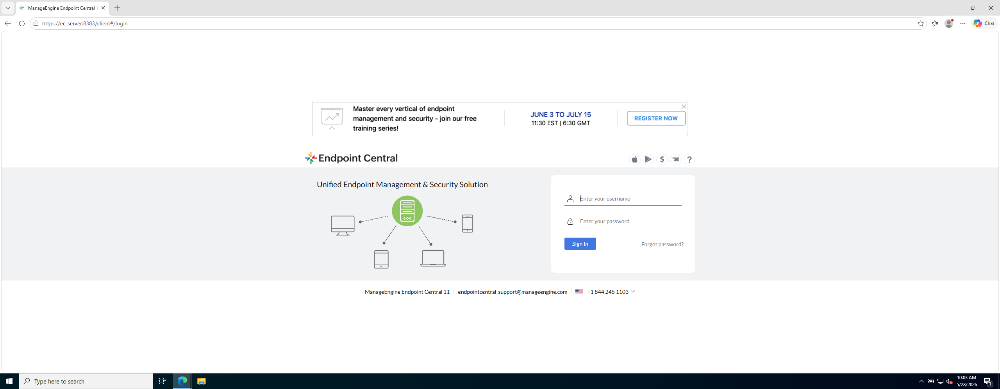
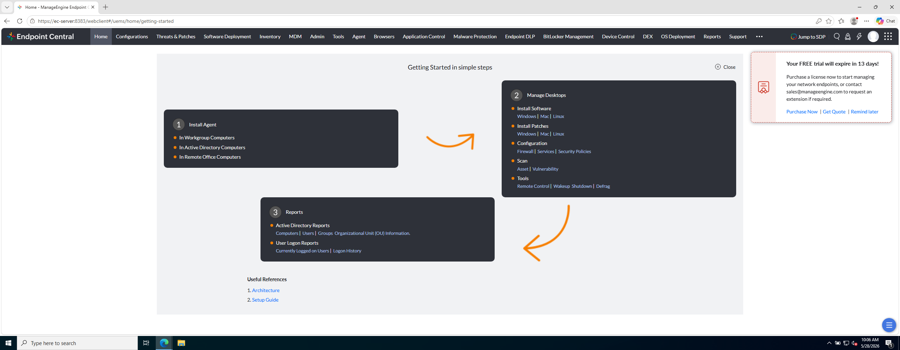

# Laboratorio M1-01 — Acceso a la consola

[← M1](README.md) · [Siguiente: M1-02 →](02-modulo-agent.md)

Objetivo: entrar en Endpoint Central y reconocer la pantalla inicial tras el login.

---

### Paso 1 — Abrir la consola en el navegador

En el host (no dentro de la VM cliente), abre **Chrome** o **Edge**.

Navega a la consola del servidor de laboratorio:

```
https://192.168.56.10:8383/webclient
```

Si en tu entorno usáis hostname:

```
https://ec-server:8383/webclient
```

> **Certificado:** algunos entornos trial usan el puerto `8020`. Si `8383` no responde, prueba `https://192.168.56.10:8020`.

El navegador mostrará aviso de **certificado no confiable**. En laboratorio: **Avanzado → Continuar** (o equivalente). En producción esto se resuelve con certificado válido; aquí es normal.

---

### Paso 2 — Iniciar sesión

En la pantalla de login introduce las **credenciales de administrador del laboratorio** (las recibirás en el briefing de acceso a tu entorno).

**Referencia — pantalla de login:**



Tras autenticarte deberías ver la consola cargando el entorno web.

---

### Paso 3 — Reconocer Getting Started

Tras el primer login suele aparecer **Getting Started**: asistente de puesta en marcha y aviso de **periodo de evaluación** (trial).

**Referencia:**



**Comprueba:**

- Ves el nombre del producto (Endpoint Central / UEMS).
- Aparece información del trial (días restantes).
- Puedes cerrar o saltar el asistente para acceder al menú principal.

No es obligatorio completar todo el asistente ahora; en este curso iremos módulo a módulo por el menú lateral.

---

## Antes de seguir

Has entrado en la consola. Eso ya es la base de todo el curso: desde aquí no «instalas» Endpoint Central, **operas** el parque.

### Pon el foco en

- La consola es una **aplicación web** servida por tu servidor EC (no un programa instalado en tu PC).
- El aviso de **certificado** es normal en trial/lab; en producción se sustituye por certificado válido.
- **Getting Started** es un asistente de puesta en marcha; en formación el entorno ya viene preparado — puedes cerrarlo y usar el menú lateral.

### Reto (tómate tu tiempo)

1. ¿Cuántos **días de trial** te quedan? ¿Qué implicaría en un proyecto real si se agotara la licencia de evaluación?
2. Recorre el **menú lateral** sin pulsar nada crítico: ¿qué módulos reconoces ya (Agent, Inventory, Admin…)?
3. Compara tu pantalla con la captura de Getting Started: ¿coincide el idioma, el nombre del producto, la versión?

Cuando lo tengas claro, pasa al siguiente ejercicio.

→ **[M1-02 — Módulo Agent](02-modulo-agent.md)**
