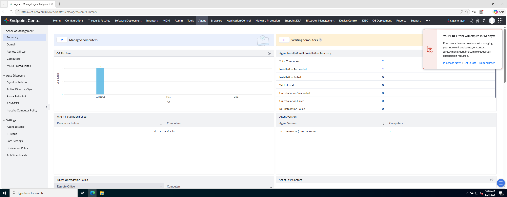

# Laboratorio M1-02 — Módulo Agent

[← M1-01](01-acceso-consola.md) · [M1](README.md) · [Siguiente: M1-03 →](03-equipos-gestionados.md)

Objetivo: localizar el módulo **Agent** y leer el resumen de instalación de agentes en el parque.

---

### Paso 1 — Abrir el menú Agent

En la consola, menú lateral izquierdo:

```
Agent
```

Si el menú está colapsado, expande la sección de gestión de endpoints / agentes hasta ver **Agent**.

Entra en la vista de **resumen** (Summary / Home del módulo Agent).

---

### Paso 2 — Leer el resumen de agentes

La pantalla resume cuántos equipos tienen agente y el estado global de la instalación.

**Referencia — Agent Summary con 2 managed computers:**



**Comprueba en tu consola:**

- Aparece el recuento de **managed computers** (en lab: **2**).
- El estado de instalación del agente es correcto (sin errores masivos).
- Entiendes que este panel es la **foto rápida** del parque gestionado por agente.

---

### Paso 3 — Relacionar consola y endpoint

Piensa en el flujo (no hace falta configurar nada aún):

1. Instalas el agente en `ec-client1` (hecho en el setup del curso).
2. El agente se registra en el servidor EC.
3. La consola **Agent → Summary** refleja ese registro.

Si el resumen muestra **0** equipos o errores, **no continúes**: revisa [Checklist de incidencias](../../manual-alumno/checklist-incidencias-lab.md) (agente, firewall, aprobación).

---

## Antes de seguir

**Agent → Summary** es el «semáforo» del parque: antes de inventario, parches o despliegues, mira aquí.

### Pon el foco en

- **Agent** en el menú no es el instalador del agente: es la **consola de supervisión** de agentes ya desplegados.
- El número de **managed computers** debe coincidir con lo que esperas en el lab (normalmente 2).
- Summary es agregado; el detalle equipo a equipo está en la siguiente pantalla.

### Reto (tómate tu tiempo)

1. Repite mentalmente el flujo: agente instalado en cliente → registro en servidor → aparece en Summary. ¿En qué paso fallaría si el firewall bloquea el puerto?
2. ¿Hay algún indicador de **error** o **warning** en la pantalla? Si lo hay, léelo antes de seguir (aunque el recuento sea 2).
3. Sin cambiar nada, busca en el menú Agent si hay otra subsección además de Summary (p. ej. instalación, aprobaciones). Solo mira; no configures.

→ **[M1-03 — Equipos gestionados](03-equipos-gestionados.md)**
