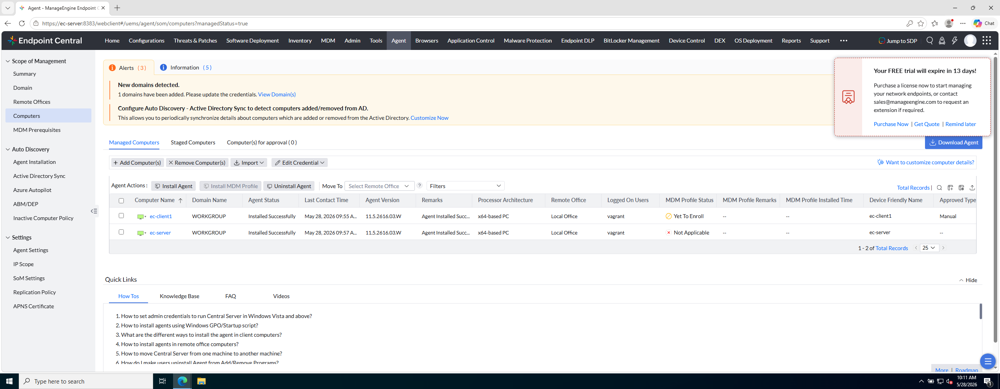

# Laboratorio M1-03 — Equipos gestionados

[← M1-02](02-modulo-agent.md) · [M1](README.md) · [Siguiente módulo: M2 →](../M2-inventario/README.md)

Objetivo: abrir **Managed Computers** y validar que `ec-server` y `ec-client1` están gestionados con agente instalado correctamente.

---

### Paso 1 — Abrir Managed Computers

Desde el módulo **Agent**, navega a:

```
Agent → Managed Computers
```

(o **Computers** / **Scope of Management**, según versión e idioma de la consola — busca la tabla de equipos con agente).

---

### Paso 2 — Localizar los equipos del laboratorio

En la tabla deberías ver al menos:

| Nombre | Significado en el lab |
|--------|------------------------|
| `ec-server` | Servidor donde corre Endpoint Central |
| `ec-client1` | Cliente Windows de prácticas |

**Referencia — Managed Computers:**



**Comprueba:**

- Ambos equipos aparecen en la lista.
- Columna de estado del agente: **Installed Successfully** (o equivalente).
- No hay equipos en **Waiting for Approval** sin resolver (si los hubiera, aprueba según el ejercicio 02 de M1).

---

### Paso 3 — Abrir el detalle de un equipo (opcional)

Haz clic en `ec-client1` (o en el icono de detalle).

Observa qué información básica muestra: nombre, dominio/workgroup, última comunicación. No cambies configuración todavía; en **M2** profundizarás inventario desde aquí.

---

## Antes de seguir

Has cerrado el círculo M1: consola accesible y endpoints **gestionados**. Todo lo demás del curso parte de esta tabla.

### Pon el foco en

- **Gestionado** = agente instalado + comunicación con el servidor + (si aplica) aprobación en consola.
- **Installed Successfully** no significa «última acción OK»; significa que el **agente está operativo**.
- `ec-server` también puede aparecer gestionado (el servidor se administra a sí mismo en muchos despliegues).

### Preguntas de cierre

1. ¿Cuántos equipos gestionados ves? ¿Coincide con Summary del ejercicio anterior?
2. Abre el detalle de `ec-client1`: ¿cuándo fue la **última comunicación** con el servidor? ¿Qué pasaría si apagaras la VM cliente?
3. Si hubiera un equipo en **Waiting for Approval**, ¿sabrías dónde buscar la acción Approve? (Revisa el módulo Agent si no lo ves en tu entorno.)
4. ¿Qué revisarías si un compañero dice «no me sale el cliente en la lista»? (agente, aprobación, comunicación, firewall).

Continúa con inventario cuando tengas claro el checklist.

→ **[M2 — Inventario y organización](../M2-inventario/README.md)**
