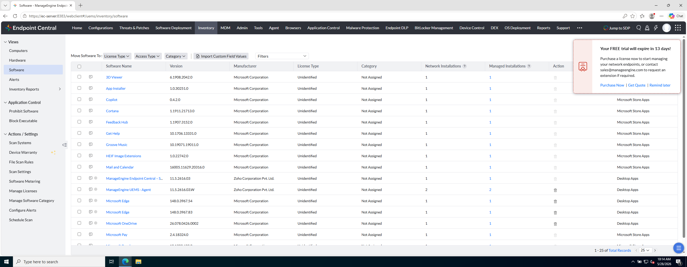

# Laboratorio M2-01 — Inventario de software

[← M2](README.md) · [Siguiente: M2-02 →](02-inventario-equipos.md)

Objetivo: abrir **Inventory → Software** y localizar aplicaciones detectadas en los endpoints del lab.

---

### Paso 1 — Abrir Inventory

Menú lateral:

```
Inventory → Software
```

URL típica: `#/uems/inventory/software`

---

### Paso 2 — Explorar el listado

Verás aplicaciones detectadas en el parque, con recuento de instalaciones.

**Referencia:**



**Comprueba:**

- Hay filas de software (navegador, componentes Windows, utilidades del lab…).
- Puedes ordenar o buscar por nombre.
- Alguna columna indica **en cuántos equipos** está instalada cada app.

---

### Paso 3 — Entrar en el detalle de una aplicación

Haz clic en una aplicación que aparezca en **más de un equipo** (si existe).

Observa qué equipos la tienen instalada. Relaciona con `ec-client1` y `ec-server`.

---

## Antes de seguir

Esta vista responde: *«¿Tengo X software instalado y en cuántos equipos?»* — típica pregunta de auditoría o licencias.

### Pon el foco en

- El listado **no es tiempo real al segundo**: refleja el último inventario que reportó cada agente.
- La columna de **recuento de instalaciones** te dice si una app es común o solo está en un equipo.
- Desde aquí ves el parque **por aplicación**; en el siguiente ejercicio lo verás **por equipo**.

### Reto (tómate tu tiempo)

1. Encuentra **una aplicación** que esté solo en `ec-client1` y **otra** que esté en ambos equipos (si existe). ¿Por qué podría estar solo en uno?
2. Ordena o filtra por nombre: ¿aparece algún software que no esperabas? ¿Es basura, trial o herramienta del lab?
3. Entra en el detalle de una app instalada en un solo equipo: ¿qué información extra te da respecto a la fila de la tabla?

→ **[M2-02 — Inventario de equipos](02-inventario-equipos.md)**
