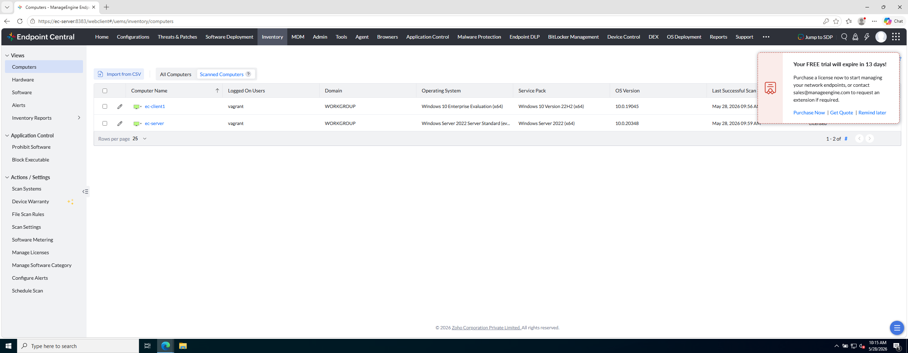

# Laboratorio M2-02 — Inventario de equipos

[← M2-01](01-inventario-software.md) · [M2](README.md) · [Siguiente: M2-03 →](03-inventario-hardware.md)

Objetivo: usar **Inventory → Computers** para ver cada endpoint como activo central.

---

### Paso 1 — Abrir la vista Computers

```
Inventory → Computers
```

---

### Paso 2 — Localizar ec-client1 y ec-server

**Referencia:**



**Comprueba en cada fila:**

- Nombre del equipo
- Sistema operativo
- Fecha/hora del **último escaneo** de inventario
- Estado general del activo

---

### Paso 3 — Abrir ficha de ec-client1

Entra en el detalle de `ec-client1`.

Recorre las pestañas disponibles (Summary, Software, Hardware, Actions… según versión). **No ejecutes acciones destructivas**; solo familiarízate con la estructura.

---

## Antes de seguir

**Computers** es el centro de gravedad por **endpoint**: casi toda acción futura (scan, parche, despliegue) partirá de la ficha de un equipo.

### Pon el foco en

- Cada fila resume **un activo** (SO, último scan, estado).
- La ficha del equipo concentra pestañas que en las vistas agregadas (Software/Hardware) viste por otro ángulo.
- **Last scan** / último escaneo indica frescura del dato — no confundir con «última vez encendido».

### Reto (tómate tu tiempo)

1. En la ficha de `ec-client1`, recorre **todas las pestañas** sin ejecutar nada: ¿cuál te parece más útil para soporte diario? ¿cuál para auditoría?
2. Compara una pieza de software que viste en **Inventory → Software** con la pestaña Software de la ficha: ¿es la misma información con distinto formato?
3. ¿Qué campo de la fila principal usarías para detectar un equipo que **lleva días sin reportar** inventario?

→ **[M2-03 — Inventario de hardware](03-inventario-hardware.md)**
