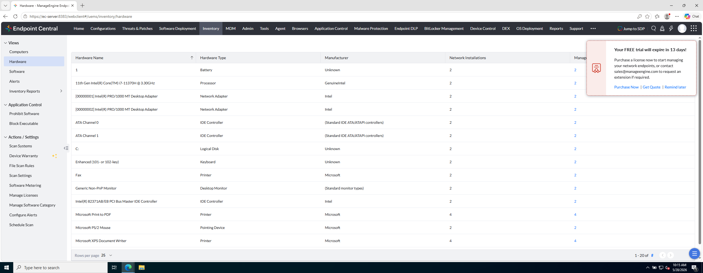

# Laboratorio M2-03 — Inventario de hardware

[← M2-02](02-inventario-equipos.md) · [M2](README.md) · [Siguiente: M2-04 →](04-asset-scan.md)

Objetivo: revisar **Inventory → Hardware** y relacionar componentes con equipos.

---

### Paso 1 — Abrir Hardware

```
Inventory → Hardware
```

---

### Paso 2 — Leer la tabla agregada

**Referencia:**



**Comprueba:**

- Componentes listados (tipo, fabricante, recuento).
- Puedes filtrar o buscar (p. ej. disco, RAM, procesador).

---

### Paso 3 — Comparar con la ficha de un equipo

Vuelve a **Computers → ec-client1 → Hardware** (pestaña).

¿Coincide lo que ves en la ficha con el agregado de **Inventory → Hardware**?

---

## Antes de seguir

**Hardware** agrega por **tipo de componente** en todo el parque; la ficha del equipo te da el detalle **local**.

### Pon el foco en

- Misma fuente de datos (agente), **distinto corte**: global vs por máquina.
- En auditoría suele pedirse RAM, disco, modelo — aquí lo obtienes sin ir equipo a equipo.
- Discrepancias entre agregado y ficha suelen ser retraso de scan, no necesariamente error.

### Reto (tómate tu tiempo)

1. Anota mentalmente **un dato de hardware** de `ec-client1` (RAM, disco, CPU) que usarías en un ticket de soporte.
2. Filtra o busca «disk» / «RAM» en la vista agregada: ¿cuántas filas salen? ¿Tiene sentido para tu parque de 2 equipos?
3. Imagina 500 equipos: ¿seguirías entrando uno a uno o usarías primero la vista Hardware agregada?

→ **[M2-04 — Asset Scan](04-asset-scan.md)**
