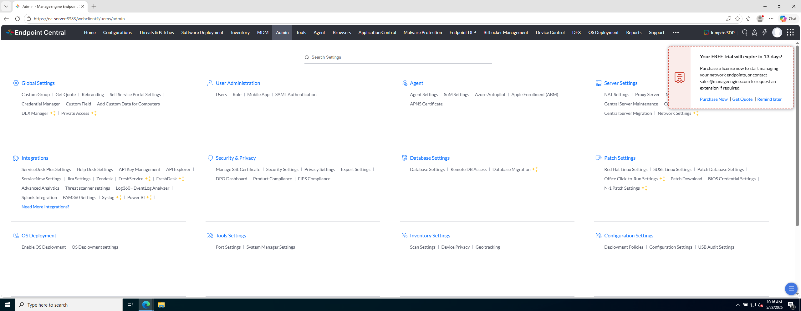
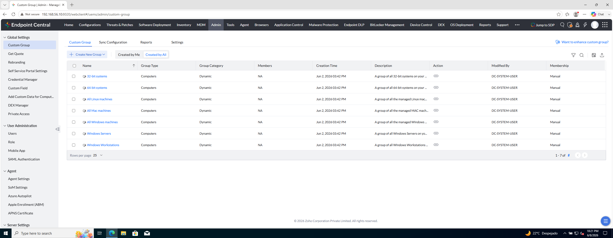

# Laboratorio — Grupos y segmentación

[← Delegación y RBAC](../M3-segmentacion-rbac/README.md) · [Segmentación del parque](README.md) · [Siguiente →](02-scope-grupos-y-prueba.md)

Objetivo: crear **Custom Groups** en el parque y entender **para qué sirven** más allá del scope de usuario.

---

### Qué es un Custom Group

Endpoint Central mantiene un **inventario** de equipos: cada PC o servidor con agente aparece en `Inventory → Computers`. Ese listado es **global** — el administrador ve todo el parque en una sola vista.

Un **Custom Group** (grupo personalizado) es otra cosa: un **conjunto con nombre** que **defines tú** en la consola. EC distingue **qué tipo de miembro** agrupa:

| Pestaña en Custom Group | Qué agrupa | Para qué sirve (ejemplos) |
|-------------------------|------------|---------------------------|
| **Computer** | Equipos con agente (`ec-client1`, servidores, portátiles…) | Segmentar el parque: scope de técnicos, parches, despliegues a máquina, informes por segmento. |
| **User** | Usuarios de dominio / Entra (personas, no máquinas) | Despliegues y configuraciones que **siguen al usuario** en el PC donde inicie sesión (perfiles, accesos directos, políticas por rol). |

En este capítulo trabajas solo con grupos **Computer** — es la segmentación del parque. Los grupos **User** existen en el mismo módulo (pestaña **User**); no los creas aquí, pero conviene saber que comparten pantalla con los de equipos.

Dentro de cada pestaña, los grupos **Computer** que crearás son **Static Unique**: les pones un nombre (`Grupo-Clientes`, `Grupo-Servidores`…) y eliges qué máquinas entran. EC guarda ese objeto y lo puedes **referenciar** en otros módulos sin volver a seleccionar equipos uno a uno.

| Pregunta | Respuesta |
|----------|-----------|
| **¿Para qué sirve?** | Operar sobre un **segmento del parque** de forma repetible: acotar qué ve un técnico, aplicar un parche solo a un grupo, desplegar software, filtrar un informe, programar una tarea… |
| **¿Sustituye al inventario?** | No. El inventario **enumera** todos los endpoints; el grupo **organiza** un subconjunto con nombre. |
| **¿Es lo mismo que el scope de usuario (RBAC)?** | No. El **grupo** es un objeto del parque; el **scope** limita qué parte del parque puede ver y gestionar **un operador concreto**. En RBAC dejaste `tecnico1` con **All Computers**; aquí creas los grupos y en el [ejercicio 02](02-scope-grupos-y-prueba.md) acotas su scope a uno de ellos. |
| **¿Es lo mismo que una OU de Active Directory?** | No necesariamente. Puedes alinear grupos con OUs o departamentos, pero en EC el Custom Group es un **objeto propio de la consola** — útil aunque no tengas AD o quieras una segmentación distinta a la del directorio. |

En **Admin → Custom Group** verás, además, dos familias por **origen** del grupo (en la pestaña **Computer**):

| Tipo en la UI | Origen | Ejemplo en pantalla |
|---------------|--------|---------------------|
| **Dynamic** | Predefinidos por EC según criterios (SO, rol Windows, etc.) | `All Windows machines`, `Windows Servers` |
| **Static Unique** (custom) | Los creas tú — membresía manual o por reglas | `Grupo-Clientes`, `Grupo-Servidores` (este ejercicio) |

Los **Dynamic** los usa el producto para vistas rápidas; en el lab **no los editas**. Los **Static Unique** son los que crearás: cada equipo del lab entrará en **un solo** grupo custom, para evitar solapamientos al asignar scope o despliegues.

---

### Paso 1 — Pre-requisitos

Antes de empezar deberías tener:

| Pieza | Estado |
|-------|--------|
| Rol `lab-read` | Creado |
| SMTP + `tecnico1` activado | Hecho |
| Scope de `tecnico1` | **All Computers** (definido en RBAC) |

En este ejercicio creas los **grupos**; en el siguiente acotas el scope a uno de ellos.

---

### Paso 2 — Entrar en la gestión de grupos

**Para qué.** Llegar al módulo donde se crean los Custom Groups del apartado anterior. En este paso **solo abres** la pantalla correcta; el alta de `Grupo-Clientes` y `Grupo-Servidores` es el paso 3.

---

#### Acción A — Abrir Admin → Custom Group

Menú superior:

```
Admin
```

En la rejilla, pulsa **Custom Group** (columna **Global Settings**).

**Referencia — rejilla Admin (dónde pulsar):**



| En la captura | Descripción |
|---------------|-------------|
| **Custom Group** (enlace a pulsar) | Objetivo de esta acción: abre el módulo de grupos personalizados del parque. |
| Bloque **Global Settings** | Columna donde está **Custom Group** (Credential Manager, Custom Field y Rebranding en el mismo bloque). |
| Pestaña **Admin** (barra superior) | Rejilla de configuración global; activa en esta vista. |

---

#### Acción B — Pestaña Computer (grupos de equipos)

Tras pulsar **Custom Group**, la consola muestra dos pestañas: **Computer** y **User**. En este ejercicio usas **Computer** — grupos de equipos gestionados. La pestaña **User** agrupa usuarios de dominio (no la confundas con **Admin → Users**, que son cuentas de la consola).

**Referencia — vista Custom Group → Computer (objetivo de este paso):**



| En la captura | Descripción |
|---------------|-------------|
| **Custom Group** (módulo abierto) | Tras el clic: menú lateral con **Custom Group** seleccionado y el listado de grupos en el panel central. |
| **+ Create New Group** | Botón azul arriba a la izquierda — crea un grupo personalizado nuevo. |
| Pestañas **Computer** / **User** | **Computer** activa — listado de grupos de equipos. **User** — grupos de usuarios de dominio (misma pantalla, otro tipo de miembro). |
| Tabla de grupos | Listado actual: filas **Dynamic** del sistema (`All Windows machines`, `Windows Workstation`, `Windows Servers`…); columnas Name, Group Category, Members, Description… |

**Comprueba:** pestaña **Computer**, tabla visible y botón **+ Create New Group**. → Continúa en el **paso 3**.

---

### Paso 3 — Crear `Grupo-Clientes`

Pulsa **+ Create New Group**. Se abre el asistente **Create New Computer Group** (breadcrumb `Custom Group > Create New Computer Group`).

---

#### Bloque «Name and Description»

| Campo / opción | Qué es | En la práctica |
|----------------|--------|----------------|
| **Group Name** | Nombre del grupo — cómo lo verás en listados, scope y despliegues. | Texto libre; en el lab: `Grupo-Clientes`. **Add Description** ayuda cuando hay muchos grupos y otros técnicos deben entender para qué sirve cada uno. |
| **Category → Static** | Membresía **manual**: tú eliges qué equipos entran. Un mismo equipo puede estar en **varios** grupos Static. | Ejemplo: un PC en `Grupo-Pilotaje-Parches` y a la vez en `Grupo-Finanzas`. Solo cambia si editas el grupo. |
| **Category → Static Unique** | También manual, pero **exclusiva**: un equipo solo puede pertenecer a **un** grupo Static Unique. Al añadirlo a otro, EC lo quita del anterior. | Segmentación sin solapamiento: clientes / servidores / sedes. **Es la opción del lab** — `ec-client1` solo en `Grupo-Clientes`, `ec-server` solo en `Grupo-Servidores`. |
| **Category → Dynamic** | Membresía por **criterios** (SO, nombre, hardware…). EC evalúa en cada despliegue; la lista no es fija como en Static. | Como `All Windows machines` del listado: entran y salen solos según cumplan criterios. Útil en parques grandes; menos control fino que un Static manual. |
| **Membership → Assign manually** | Seleccionas equipos uno a uno en **Select Computers** (paneles izquierda/derecha). | **Opción del lab** — sin AD, eliges `ec-client1` a mano. En producción con pocos equipos o pruebas puntuales. |
| **Membership → AD Groups** | El grupo toma miembros de un grupo de **Active Directory** sincronizado con EC. | El parque sigue al directorio: si cambia la membresía AD, puede actualizarse el grupo. Requiere dominio integrado (el lab WORKGROUP no aplica). |
| **Membership → Entra Groups** | Igual con grupos de **Microsoft Entra** (Azure AD). | Entorno cloud o híbrido: el grupo refleja Entra sin mantener listas a mano. Requiere directorio cloud enlazado. |

**Por qué Static Unique en el lab.** Queremos que `ec-client1` esté solo en `Grupo-Clientes` y `ec-server` solo en `Grupo-Servidores`, sin ambigüedad al usar el grupo como scope o target.

---

#### Bloque «Select Computers»

Visible con **Assign manually**. Dos paneles:

| Zona | Qué es | En la práctica |
|------|--------|----------------|
| **Available Computers** (izquierda) | Equipos gestionados que aún no forman parte del grupo. | Pestañas **Tree** (por dominio/OU), **List** (lista plana — la de la captura), **Import** (CSV masivo). |
| **Added Computers** (derecha) | Miembros que entrarán en el grupo al confirmar. | En el lab debe quedar solo **`ec-client1`**. Lo que aparezca aquí es lo que EC tratará como `Grupo-Clientes`. |

Selecciona `ec-client1` en la izquierda y pásalo a **Added Computers** (clic o flecha, según la UI).

---

#### Valores para el lab

| Campo | Valor lab |
|-------|-----------|
| Group Name | `Grupo-Clientes` |
| Group Category | **Static Unique** |
| Membership | **Assign manually** |
| Added Computers | **`ec-client1`** |

Pulsa **Create Group**.

**Referencia — opciones elegidas antes de Create Group:**


| En la captura | Descripción |
|---------------|-------------|
| **Group Name** | `Clientes` — nombre del grupo en el formulario (en el lab: `Grupo-Clientes`). |
| **Category** | **Static Unique** seleccionada. |
| **Membership** | **Assign manually** seleccionada. |
| **Available Computers** | `ec-server` — único equipo que queda fuera del grupo. |
| **Added Computers (2)** | `ec-client1`, `ec-client2` — miembros del grupo. En material alumno (2 VMs) solo entra **`ec-client1`**. |
| **Create Group** | Confirma con el nombre y los equipos en **Added Computers**. |
---

### Paso 4 — Crear `Grupo-Servidores`

Repite el asistente con:

| Campo | Valor lab |
|-------|-----------|
| Group Name | `Grupo-Servidores` |
| Group Category | **Static Unique** |
| Resource type | **Computer** |
| Membership | **Assign manually** |
| Miembros | **`ec-server`** |

**Comprueba:**

- `Grupo-Clientes` contiene solo `ec-client1`.
- `Grupo-Servidores` contiene solo `ec-server`.
- Cada equipo pertenece a un solo grupo **Static Unique**.

| Grupo | Miembros | Uso en el curso |
|-------|----------|-----------------|
| **`Grupo-Clientes`** | **`ec-client1`** | Scope de `tecnico1`, target parches M4, deploy M6 |
| **`Grupo-Servidores`** | **`ec-server`** | Segmentar infra del servidor EC |

---

### Paso 5 — Usos del mismo grupo

El objeto **`Grupo-Clientes`** se reutiliza en varios módulos:

| Uso | Ejercicio | Pregunta que responde |
|-----|-----------|------------------------|
| **Scope de usuario** | [02 — Scope e inventario](02-scope-grupos-y-prueba.md) | ¿Qué PCs ve este operador? |
| **Target de parches** | M4 | ¿A quién aplico este KB? |
| **Target de software** | M6 | ¿Dónde instalo el package? |
| **Filtro de informe** | M7 | ¿Qué parque incluyo en el PDF? |
| **Tarea programada** | M5 | ¿Quién recibe el scan/script? |

**Comprueba:** el grupo se define una vez y se referencia en scope, despliegues e informes.

---

### Paso 6 — Inventario como admin (vista previa)

Como **admin**, abre:

```
Inventory → Computers
```

Abre la ficha de `ec-client1` y confirma que sigue gestionado. Los grupos **organizan** el parque para acciones y permisos; el inventario global sigue mostrando todos los equipos.

---

## Antes de seguir

Has creado la **segmentación del parque**. El scope de usuario llega en el siguiente ejercicio.

### Pon el foco en

- **Custom Group → Computer** = conjunto de endpoints (objeto reutilizable en scope, parches, despliegues).
- **Custom Group → User** = conjunto de usuarios de dominio (despliegues que siguen a la persona); no es el foco de este capítulo.
- **Scope** = qué parte del parque puede ver/gestionar **un operador de consola** concreto.

### Preguntas de cierre

1. ¿Por qué separamos `ec-server` en `Grupo-Servidores`? (pista: parches, reboot, rol del servidor EC)
2. En producción, ¿un grupo por departamento, por sede o por ambos?
3. ¿Grupo dinámico (criterios) vs Custom Group estático? ¿Y pestaña **Computer** vs **User**? Indica un caso de uso de cada par (sin configurarlo aún).

→ **[02 — Scope, inventario y prueba](02-scope-grupos-y-prueba.md)**
