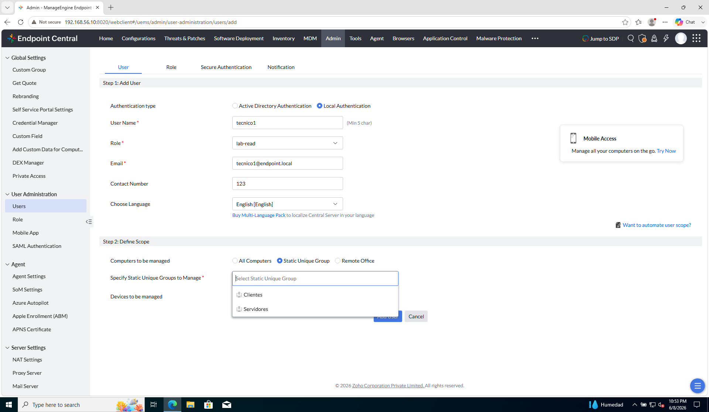
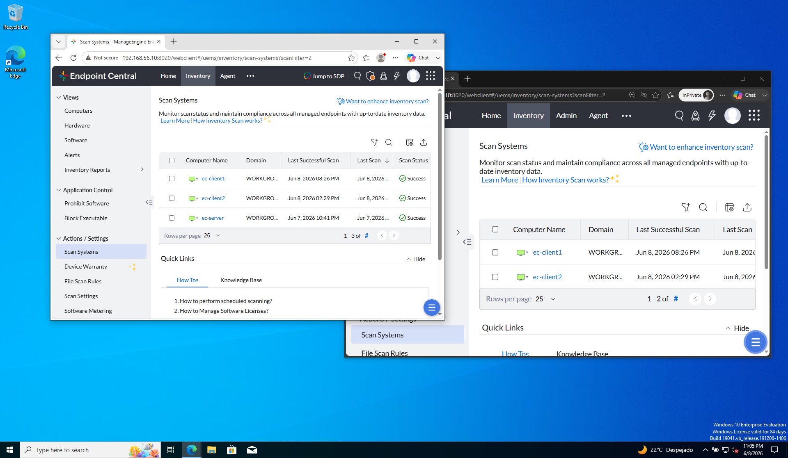

# Laboratorio — Scope, inventario y prueba

[← 01 — Grupos](01-grupos-y-segmentacion.md) · [Segmentación del parque](README.md) · [Siguiente: M4 →](../M4-parches/README.md)

Objetivo: acotar el **scope** de `tecnico1` al **`Grupo-Clientes`** y comprobar **inventario segmentado** frente a admin.

---

### Paso 1 — Editar scope de tecnico1

Abre el usuario creado en [Delegación y RBAC](../M3-segmentacion-rbac/README.md):

```
Admin → User Administration → Users → tecnico1 → Edit
```

(o **Modify** / icono de edición).

En **Define Scope** la consola te hace **dos preguntas distintas**. Respóndelas por separado:

```
¿Qué PCs Windows (con agente EC) puede gestionar este usuario?  →  Computers to be managed
¿Qué móviles/tablets (módulo MDM) puede gestionar este usuario?  →  Devices to be managed
```

En el ejercicio 01 creaste grupos en **Admin → Custom Group → Computer** (`Clientes`, `Servidores`). Esos grupos **solo sirven para la primera pregunta** (Computers).

---

#### Computers to be managed — lo que importa en este ejercicio

Aquí acotas `ec-client1`, `ec-server`, etc.

| Qué marcar | Valor en el lab |
|------------|-----------------|
| Tipo | **Static Unique Group** |
| Grupo | **`Clientes`** (material alumno: `Grupo-Clientes`) |

Con eso `tecnico1` solo verá los equipos de ese Custom Group **Computer**.

---

#### Devices to be managed — móviles/tablets (MDM)

Este bloque **no tiene que ver** con `Clientes` / `Servidores`. EC repite la misma idea de “alcance”, pero para otro inventario: teléfonos y tablets enrolados en el módulo **MDM** (menú **MDM** de la consola), no las VMs Windows del lab.

| Opción | Significado |
|--------|-------------|
| **All Devices** | Si el usuario tuviera permisos MDM, vería **todos** los móviles/tablets enrolados en el servidor. |
| **Selected group(s)** | Solo vería los móviles/tablets que pertenezcan a **grupos creados dentro de MDM** (p. ej. “Móviles Ventas”, “Tablets Almacén”). Esos grupos se definen en el módulo MDM, **no** en Admin → Custom Group → Computer. |

**Qué hacer en nuestro lab:** deja **All Devices**.

**Por qué:** en el lab solo hay tres VMs Windows con agente. **No hay móviles enrolados en MDM.** El bloque Devices no filtra nada sobre `ec-client1` — da igual All Devices o Selected group(s) porque no hay dispositivos MDM. Lo dejamos en **All Devices** (suele venir por defecto) y **no toques Selected group(s)**.

**Resumen en una línea:** Computers = parque Windows del curso (aquí acotas con `Clientes`); Devices = parque móvil MDM (fuera del curso; en el lab, ignóralo y deja All Devices).

Guarda los cambios.

**Referencia — Define Scope con Static Unique Group:**



| En la captura | Descripción |
|---------------|-------------|
| **Step 2: Define Scope** | Dos bloques: alcance **Computers** (UEM) y **Devices** (MDM). |
| **Computers to be managed** | **Static Unique Group** seleccionada (alternativas: All Computers, Remote Office). |
| **Specify Static Unique Groups to Manage** | Desplegable: **Clientes** y **Servidores** — Custom Groups **Computer** Static Unique del ejercicio 01. |
| **Devices to be managed** | Segunda pregunta: alcance **MDM** (móviles/tablets). **All Devices** = todos los enrolados; **Selected group(s)** = solo grupos del módulo MDM (no `Clientes`/`Servidores`). En el lab: **All Devices** — no hay móviles; no afecta al ejercicio. |
| **Step 1 (contexto)** | Usuario `tecnico1`, rol `lab-read` — datos del alta en RBAC. |

> Si tu consola no permite editar scope, crea `tecnico-clientes` con el mismo rol y scope en grupo; el ejercicio es el mismo.

**Comprueba:** el usuario ya no tiene **All Computers** sino el grupo concreto.

---

### Paso 2 — Rol + scope (resumen)

Resume en una frase:

> El rol `lab-read` permite **leer** inventario e informes. El scope **Computers → Static Unique Group → `Grupo-Clientes`** limita a **solo `ec-client1`** en nuestro lab. **Devices → All Devices** no cambia nada mientras no haya MDM. All Computers + Read = ve todo el parque; **Grupo Computer + Read** = ve solo ese segmento.

---

### Paso 3 — Login y contraste (obligatorio)

1. Sesión **admin** en una ventana (o pestaña).
2. Sesión **`tecnico1`** en ventana privada.

En ambas, abre:

```
Inventory → Computers
```

**Referencia — contraste admin vs tecnico1:**



| En la captura | Descripción |
|---------------|-------------|
| Ventana **izquierda** (admin) | **Inventory → Computers** — tres equipos: `ec-client1`, `ec-client2`, `ec-server`. |
| Ventana **derecha** (`tecnico1`, InPrivate) | Misma ruta — solo equipos del scope **Computers → Static Unique Group → Clientes**. |
| `ec-server` | Visible en admin; **ausente** en `tecnico1` (pertenece al grupo **Servidores**, fuera de scope). |
| `ec-client1`, `ec-client2` | Visibles en ambas sesiones en el piloto (ambos en el grupo **Clientes**). Material alumno con una sola VM cliente: `tecnico1` vería solo **`ec-client1`**. |

| Vista | Admin | tecnico1 |
|-------|-------|----------|
| Equipos visibles | `ec-server` + clientes del parque | Solo equipos del grupo **Clientes** (scope) |
| `ec-server` | Visible | **No visible** (fuera de scope) |

Comprueba también en **Inventory → Software** si la consola filtra por scope: el técnico solo debe ver datos agregados de **su** segmento.

**Comprueba:** la diferencia es de **scope/grupo**, no de rol — el rol sigue siendo `lab-read`.

---

### Paso 4 — Qué no cambia con el scope

Como `tecnico1`, confirma que **sigue sin poder**:

- Entrar a **Admin → Add User**
- Desplegar parches o software (según matriz `lab-read`)

El scope **no amplía** permisos; solo **recorta** el parque visible y sobre el que podría actuar si tuviera Write.

---

### Paso 5 — Puente a M4

Anota para el siguiente módulo:

> En **M4-02** no crearemos un grupo nuevo: usaremos **`Grupo-Clientes`** como **target** del despliegue piloto de parches.

Mismo grupo, otro uso (target operativo, no scope de usuario).

---

## Antes de seguir

Has cerrado el triángulo de segmentación:

```
ROL  +  GRUPO  +  SCOPE en grupo  +  ACTIVACIÓN
```

### Pon el foco en

- **Computers to be managed** usa los **Custom Groups Computer** (Static Unique) del ejercicio 01.
- **Devices to be managed** es scope **MDM** (móviles/tablets); **no** usa esos Custom Groups. En el curso dejamos **All Devices**; MDM queda fuera del temario.
- Primero defines al operador (rol y activación); luego acotas el **segmento del parque Windows** con grupos Computer.

### Preguntas de cierre

1. ¿Qué vería `tecnico1` si le pusieras scope `Grupo-Servidores` en lugar de `Grupo-Clientes`?
2. ¿Un admin necesita scope en grupo? (No — admin ve todo el SoM.)
3. Define un segundo operador `tecnico-servidores` con scope en `Grupo-Servidores`: ¿qué módulos le darías en el rol?

Cuando el contraste admin vs `tecnico1` en Inventory sea claro, continúa con parches.

→ **[M4 — Gestión avanzada de parches](../M4-parches/README.md)**
