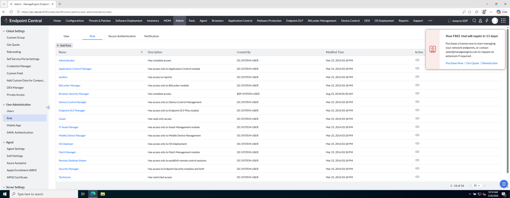
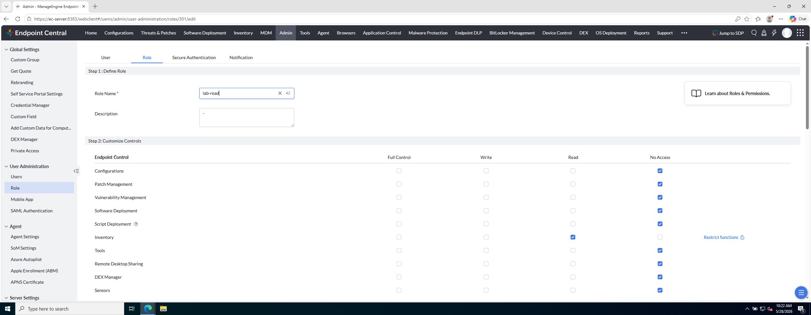

# Laboratorio M3-01 — Admin y roles

[← M3](README.md) · [Siguiente: M3-02 →](02-smtp-laboratorio.md)

Objetivo: entrar en **Admin**, revisar roles existentes y crear un rol limitado `lab-read`.

---

### Paso 1 — Abrir Admin

Menú lateral:

```
Admin
```

Verás bloques como User Administration, Server Settings, Security, etc.

**Referencia — rejilla Admin:**


---

### Paso 2 — Ir a Role

```
Admin → User Administration → Role
```

**Referencia — lista de roles:**



Observa roles predefinidos (Patch Manager, Technician, Guest…). Son plantillas de permisos para distintos perfiles operativos.

---

### Paso 3 — Crear rol custom

Pulsa **Add Role** (+).

1. **Nombre:** `lab-read`
2. **Descripción:** lectura de inventario e informes.

En el paso **Customize Controls** configura la matriz:

| Módulo | Permiso sugerido para el lab |
|--------|------------------------------|
| Inventory | **Read** |
| Report | **Read** |
| Resto de módulos sensibles | **No Access** o mínimo necesario |

**Referencia — matriz del rol:**



Guarda el rol.

---

### Paso 4 — Comprueba

- `lab-read` aparece en la lista de roles.
- Inventory y Report quedan en Read; no tiene control total de Admin.

---

## Antes de seguir

Acabas de crear **delegación mínima**: un rol que solo lee inventario e informes.

### Pon el foco en

- **Full / Write / Read / No Access** se aplican **por módulo**, no «todo o nada».
- Los roles predefinidos (Patch Manager, Technician…) son **plantillas**; en enterprise casi siempre ajustas uno custom.
- Un rol restrictivo reduce riesgo si la cuenta se compromete o el técnico se equivoca.

### Preguntas de cierre

1. Abre un rol predefinido (p. ej. **Technician**) solo para mirar: ¿en qué módulos difiere de tu `lab-read`?
2. ¿Qué pasaría si dejaras **Admin** en Read en lugar de No Access? ¿Seguiría siendo un rol «de lectura»?
3. Define un rol **Auditor**: ¿qué módulos en Read y cuáles en No Access?

Sin SMTP configurado no podrás activar usuarios: eso es el siguiente ejercicio.

→ **[M3-02 — SMTP de laboratorio](02-smtp-laboratorio.md)**
