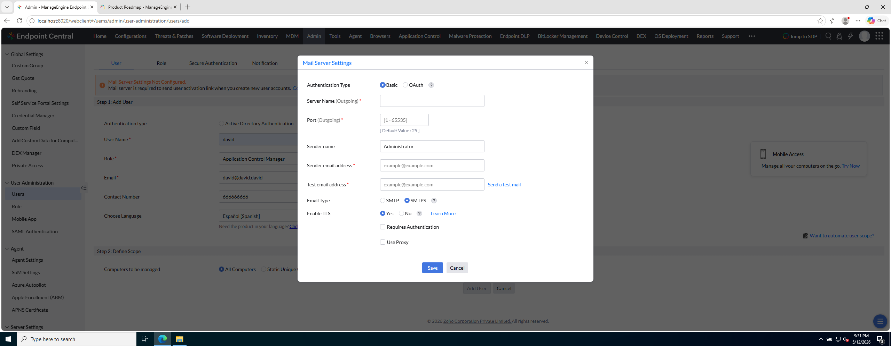

# Laboratorio M3-02 — SMTP de laboratorio

[← M3-01](01-admin-y-roles.md) · [M3](README.md) · [Siguiente: M3-03 →](03-usuario-y-scope.md)

Objetivo: configurar un **servidor SMTP local** para que Endpoint Central envíe el enlace de activación al crear usuarios.

Guía completa de opciones: [SMTP en laboratorio](../../docs/smtp-laboratorio.md)

---

### Paso 1 — Entender el requisito

Al pulsar **Add User**, la consola puede mostrar:

> *Mail server required to send user activation link*

Hasta que SMTP esté guardado y probado, el flujo de alta queda incompleto.

**Referencia — Mail Server Settings:**



---

### Paso 2 — Abrir Mail Server Settings

Ruta habitual:

```
Admin → (Server Settings / Mail) → Mail Server Settings
```

(o el asistente que aparece al intentar **Add User**).

---

### Paso 3 — Configurar SMTP del lab

Usa los valores de [SMTP de laboratorio](../../docs/smtp-laboratorio.md). Ejemplo típico con **Mailpit** en el host:

| Campo | Valor lab |
|-------|-----------|
| Server | `192.168.56.1` |
| Port | `1025` |
| Email Type | SMTP |
| TLS | No |
| Authentication | No |

Guarda (**Save**) y envía **correo de prueba** si la consola lo permite.

Bandeja web Mailpit: `http://127.0.0.1:8025`

---

### Paso 4 — Comprueba

- Configuración guardada sin error.
- Test mail recibido en la bandeja de lab (Mailpit u otra instancia SMTP local).

Si falla: revisa firewall, IP alcanzable desde la VM servidor y [Checklist incidencias](../../manual-alumno/checklist-incidencias-lab.md).

---

## Antes de seguir

Endpoint Central **no es solo consola web**: el alta de operadores depende de **correo saliente** para activación.

### Pon el foco en

- Sin SMTP, **Add User** queda a medias: el usuario existe pero no puede activarse.
- En lab usamos Mailpit/smtp4dev; en producción, SMTP corporativo con TLS y autenticación.
- El enlace de activación debe ser **alcanzable** desde donde abra el correo el alumno (hostname vs IP, puerto 8020/8383).

### Reto (tómate tu tiempo)

1. Abre la bandeja Mailpit (`http://127.0.0.1:8025` si aplica): ¿llegó el correo de prueba? ¿Desde qué remitente?
2. Si el enlace de activación usara `https://ec-server:8383/...` y tu PC no resuelve ese nombre, ¿qué cambiarías?
3. ¿Por qué en empresa no basta con «SMTP en localhost del servidor» si el usuario activa desde su portátil?

→ **[M3-03 — Usuario y scope](03-usuario-y-scope.md)**
