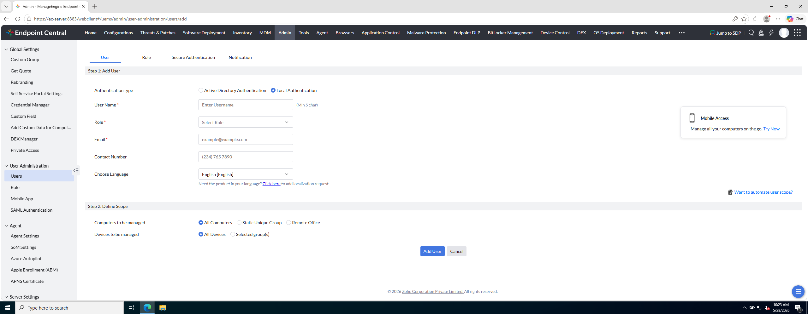
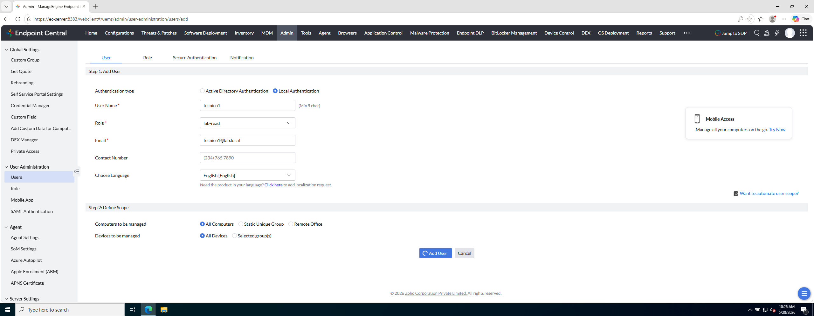
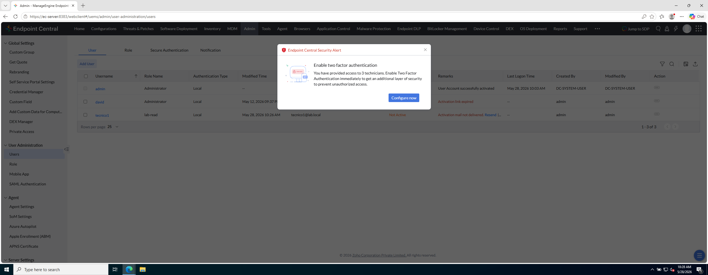

# Laboratorio M3-03 — Usuario y scope

[← M3-02](02-smtp-laboratorio.md) · [M3](README.md) · [Siguiente: M3-04 →](04-activacion-y-prueba.md)

Objetivo: crear el usuario `tecnico1` con rol `lab-read` y definir su **scope**.

---

### Paso 1 — Add User

```
Admin → User Administration → Users → Add User
```

---

### Paso 2 — Paso 1 del asistente (identidad y rol)

Completa:

| Campo | Valor lab |
|-------|-----------|
| User name | `tecnico1` |
| Role | `lab-read` |
| Language | el que prefieras (Español / English) |

Email: usa una dirección válida para el SMTP de lab (p. ej. `tecnico1@lab.local`; el dominio debe ser aceptado por tu servidor SMTP local).

---

### Paso 3 — Paso 2: Define Scope

**Referencia — opciones de scope:**



La pantalla hace **dos preguntas** (detalle en [02 — Scope, paso 1](../M3-segmentacion-parque/02-scope-grupos-y-prueba.md)):

| Pregunta en pantalla | Qué marcar en M3-03 (alta de `tecnico1`) |
|----------------------|------------------------------------------|
| **Computers to be managed** — ¿qué PCs Windows? | **All Computers** |
| **Devices to be managed** — ¿qué móviles/tablets MDM? | **All Devices** (en el lab no hay MDM; déjalo así) |

Opciones del bloque **Computers**:

| Scope | Cuándo usarlo |
|-------|----------------|
| **All Computers** | Todo el parque UEM (lab: aceptable con pocos equipos) |
| **Static Unique Group** | Solo un Custom Group **Computer** Static Unique |
| **Remote Office** | Solo sedes/oficinas remotas definidas |

Para este ejercicio: **Computers → All Computers**, **Devices → All Devices**. Más adelante, en [Segmentación del parque](../M3-segmentacion-parque/02-scope-grupos-y-prueba.md), cambiarás **Computers** a **Static Unique Group → Clientes**; **Devices** sigue en All Devices.

---

### Paso 4 — Confirmar alta

**Referencia — formulario completo:**



Pulsa **Add User**. Tras guardar puede aparecer aviso de **Two Factor Authentication**.

**Referencia — alerta 2FA:**



En el lab **no activamos 2FA ahora**; es un refuerzo de seguridad para producción. Cierra o pospone la alerta.

---

### Paso 5 — Comprueba

- Usuario `tecnico1` listado en Users.
- Rol `lab-read` asignado.
- Scope coherente con lo elegido.

---

## Antes de seguir

Has unido **rol** (qué puede hacer) y **scope** (sobre qué equipos). Los dos son obligatorios para delegar bien.

### Pon el foco en

- **All Computers** en lab está bien; en producción con 10.000 PCs usarías grupo o remote office.
- **Static Unique Group** fija el alcance a un conjunto concreto de máquinas.
- La alerta **2FA** es recomendación de hardening — en este curso la posponemos, no la ignores en producción.

### Preguntas de cierre

1. ¿Qué permite el rol `lab-read` y qué limita el scope **All Computers**? ¿Por qué hacen falta los dos?
2. Si un operador solo debe ver `ec-client1`, ¿qué scope elegirías? → Respuesta en [02 — Scope e inventario](../M3-segmentacion-parque/02-scope-grupos-y-prueba.md) (Static Unique Group + `Grupo-Clientes`).
3. Mira la lista de usuarios: ¿cuántos admins hay? ¿Tiene sentido que todos sean admin en una empresa grande?

→ **[M3-04 — Activación y prueba](04-activacion-y-prueba.md)**
