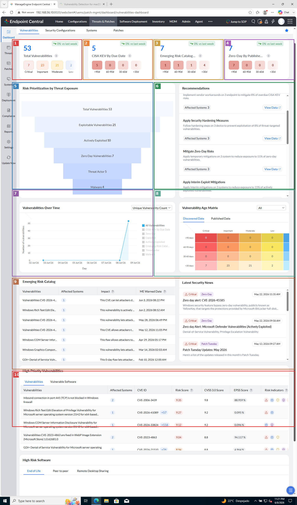
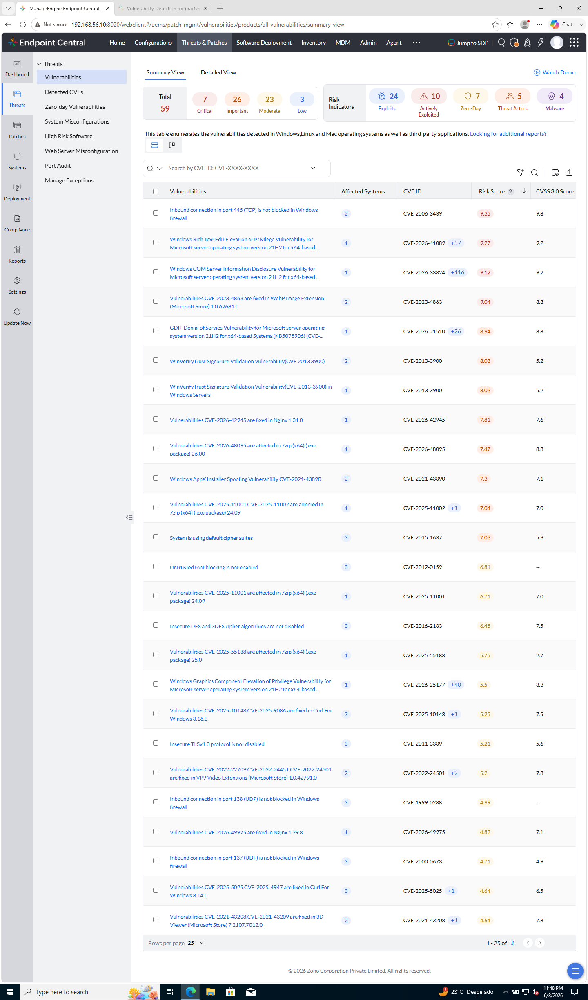
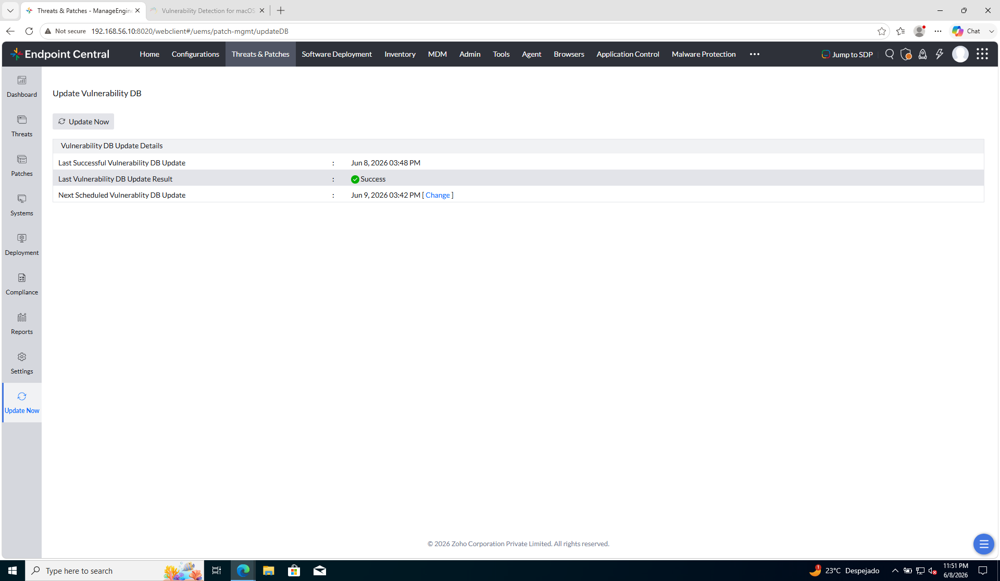
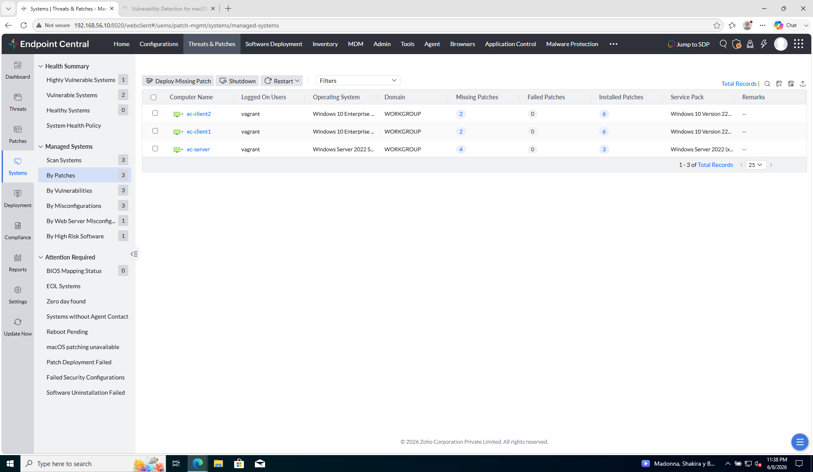
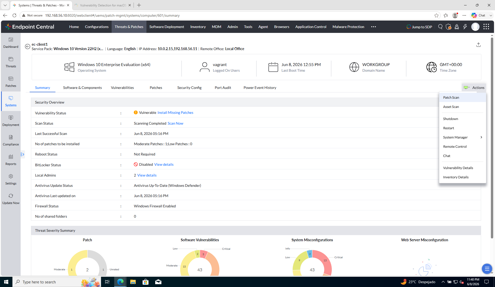

# Laboratorio M4-01 — Dashboard y faltantes

[← M4](README.md) · [Siguiente: M4-02 →](02-aprobacion-y-grupo-piloto.md)

Objetivo: entrar en **Threats & Patches**, orientarte en el módulo y localizar parches **missing** en `ec-client1`.

---

### Paso 1 — Entrar en Threats & Patches

#### Dónde está el módulo

Endpoint Central organiza la consola en **pestañas superiores** (Home, Configurations, **Threats & Patches**, Inventory, Admin…). El parcheo operativo vive en **Threats & Patches** — al pulsarla cambia el **menú lateral izquierdo** y el panel central.

| Si vienes de… | Qué confundir |
|---------------|---------------|
| **Admin → Patch Settings** | Ajustes globales (descarga de parches, Linux, Office…) — **no** es el dashboard ni el listado de missing. |
| **Inventory** | Inventario hardware/software del agente — **no** sustituye **Patches → Missing**. |
| **Threats & Patches** | Módulo correcto: scan, missing, aprobación, despliegue. |

#### Pantalla transitoria (workflows)

La **primera vez** que entras (o tras ciertas actualizaciones), EC puede mostrar unas pantallas de **workflows** o **ciclo de vida del parcheo** (sincronizar base de vulnerabilidades → escanear → identificar → desplegar → informes). Es un tour introductorio.

- Aparece **antes** del Dashboard y **desaparece** al pulsar Continue / Skip / Close.
- No es un error: es onboarding del módulo.
- Tras cerrarla, la consola deja la vista por defecto en **Dashboard** (la de la captura).

Si te vuelve a salir, recorre el flujo una vez y anota los nombres de los pasos — encajan con el lab M4 (scan en paso 2, missing en paso 3, deploy en ejercicios posteriores).

#### Menú lateral (Threats & Patches)

Tras el onboarding (o directamente si ya lo viste), el lateral incluye:

| Entrada lateral | Para qué sirve | ¿Lab M4-01? |
|-----------------|----------------|-------------|
| **Dashboard** | Resumen: vulnerabilidades, CISA KEV, recomendaciones, embudo de riesgo. | Vista de llegada (captura). No es donde escaneas ni despliegas. |
| **Threats** | Vulnerabilidades y exposición (catálogo de riesgos). | Contexto de seguridad; el lab operativo va por **Patches** / **Systems**. |
| **Patches** | Catálogo de parches: missing, installed, approve, decline… | **Paso 3** del lab. |
| **Systems** | Salud **por equipo**: last scan, missing count, acciones por PC. | **Paso 2** del lab. |
| **Deployment** | Manual Deployment, Automated Patch Deployment, Deployment Status. | M4 ejercicios 04–05. |
| **Configuration** | Políticas de despliegue, ventanas de mantenimiento. | M4-03. |
| **Compliance** / **Reports** / **Settings** | Cumplimiento, informes, ajustes del módulo. | M7 / referencia. |
| **Update Now** | Sincronizar **Vulnerability DB** con catálogo de parches de fabricantes. | Útil si missing sale vacío tras instalar agentes. |

#### Captura — Dashboard: qué es y para qué

El **Dashboard → Vulnerabilities** es el **cuadro de mando de seguridad** del parque: KPIs, tendencias y tablas de CVE. Lo abre dirección, SOC o el responsable de parches para **priorizar**, no para instalar.

| Qué es | Para qué sirve | En la práctica |
|--------|----------------|----------------|
| Dashboard de vulnerabilidades | Agregación de **exposición** (CVE, KEV, zero-day, edad del riesgo) | Reunión semanal: «¿subió el Critical? ¿hay KEV vencidos?» |
| Embudo Risk Prioritization | Filtra lo **explotable** frente al total teórico | Evita parchear solo por CVSS alto cuando lo activamente explotado es otro subset |
| High Priority Vulnerabilities | Lista accionable de CVE calientes | Puente hacia Systems / Missing — pero **no** sustituye el catálogo de parches |

No es donde instalas parches: es orientación. El lab sigue en **Systems** / **Patches** (pasos 2–4).

**Referencia anotada — contenido del Dashboard (1440×2445, portrait):**



| Marca | Qué muestra la caja | Cómo interpretarlo |
|-------|---------------------|-------------------|
| **1** | **Total Vulnerabilities (53)** — Critical / Important / Moderate / Low | Exposición global del parque. **7 Critical** = prioridad máxima. No es la lista de parches missing, pero orienta qué tan grave es el retraso de parcheo. |
| **2** | **CISA KEV By Due Date (5)** — todas **>90d** | CVEs del catálogo **Known Exploited Vulnerabilities** (explotados en la práctica). **>90d** = deuda vencida; suele saltar en auditorías y compliance. |
| **3** | **Emerging Risk Catalog (7)** (tarjeta KPI) | Conteo de riesgos **emergentes** por antigüedad del aviso. **4 con menos de 30 días** = novedad reciente a vigilar. |
| **4** | **Zero-Day By Published Date (7)** | CVEs publicados inicialmente **sin parche**. Aquí **>90d**: ya tienen historial; el widget sigue agrupándolos aparte. |
| **5** | **Risk Prioritization** (embudo) | De **53 → 21 explotables → 10 activamente explotadas → … → 4 malware**. Sirve para **priorizar** más allá del CVSS: lo explotado en la práctica pesa más. |
| **6** | **Recommendations** | Acciones sugeridas (mitigaciones, workarounds KEV, hardening) con **Affected Systems** y **View Data**. Parche + mitigación temporal mientras pruebas en piloto. |
| **7** | **Vulnerabilities over time** — título + gráfico lineal (columna izquierda) | Evolución temporal. El pico del **9 jun** en el piloto = scan reciente o actualización de la base de vulnerabilidades. |
| **8** | **Vulnerability age matrix** — título + heatmap (columna derecha) | Cruce **severidad × antigüedad**. La fila de menos de 30 días concentra el grueso del piloto. |
| **9** | **Emerging Risk Catalog** (tabla izq.) + **Latest Security News** (lista der.) | Detalle por CVE/alerta y noticias externas (Patch Tuesday, zero-days). Complementa las tarjetas KPI **3** y **4**. |
| **10** | **High Priority Vulnerabilities** (tabla ancha) | CVE, **Risk / CVSS / EPSS**, indicadores de exploit — lista operativa antes de ir a **Missing Patches**. |

Captura sin marcas: [`01-patch-management.png`](../../capturas/M4/01-patch-management.png)

#### Vista complementaria — Threats → Vulnerabilities

El **Dashboard** resume con widgets; **Threats → Vulnerabilities** es el **catálogo CVE operativo**: misma familia de datos, presentación de **tabla filtrable** para analistas.

| Qué es | Para qué sirve | En la práctica |
|--------|----------------|----------------|
| **Threats → Vulnerabilities** | Listado de hallazgos de seguridad (CVE, misconfig, puertos…) con **Affected Systems** y **Risk Score** | El analista SOC busca un CVE concreto, exporta o abre el detalle antes de pedir parcheo |
| **Summary View** (pestaña) | KPIs + tabla (59 vulns en piloto: 7 Critical, 26 Important…) | Complementa el Dashboard; aquí trabajas fila a fila |
| Columnas CVE / CVSS / Risk Score | Priorización más allá del titular | Un firewall mal configurado puede aparecer sin CVE clásico — sigue siendo remediación |

No confundir con **Patches → Missing**: aquí ves **exposición**; en Missing ves **parches instalables** para cerrar parte de esa exposición.



| En la captura | Qué es | En la práctica |
|---------------|--------|----------------|
| Total **59** vulnerabilities | Conteo tras scan + Vulnerability DB | Cifra distinta a «7 missing patches» — agrega CVE de software, misconfigs y OS |
| Tabla (puerto 445, Nginx CVE, MSRT…) | Cada fila = un **hallazgo** con alcance en **Affected Systems** | «Affected Systems: 2» → abre para ver si incluye `ec-client1` |
| **Risk Score** vs **CVSS** | Score propio EC vs estándar NIST | En CAB se debate con ambos: CVSS para compliance, Risk Score para operación |

#### Update Now — la base de conocimiento del proveedor

Sí: gran parte del «know-how» de Endpoint Central **no lo inventa tu agente** — lo aporta **ManageEngine/Zoho** en una **Vulnerability DB** (y catálogos de parches asociados) que el **servidor EC** descarga y actualiza periódicamente.

| Pieza | Qué aporta | Quién la alimenta |
|-------|------------|-------------------|
| **Agente** en `ec-client1` | Inventario local: SO, parches instalados, software, configs | Tu endpoint (scan) |
| **Vulnerability DB** en el servidor EC | CVE, KBs, reglas de misconfig, priorización, parches de terceros… | **Proveedor** (sincronización desde internet) |
| **Cruce scan + DB** | «Missing», «Vulnerable», Risk Score, recomendaciones | Motor EC en el servidor |

Sin DB reciente, el scan del agente tiene **menos contra qué comparar** — por eso existe **Update Now** y un schedule automático.

```
Threats & Patches → Update Now
```



| En la captura | Qué es | En la práctica |
|---------------|--------|----------------|
| **Update Now** | Sincronización manual inmediata de la Vulnerability DB | Tras Patch Tuesday o si missing/CVE salen vacíos tras instalar agentes |
| **Last Successful Update** | Última descarga OK del catálogo del proveedor (p. ej. 8 jun 2026) | Auditar: «¿llevamos la base más de una semana desactualizada?» |
| **Next Scheduled Update** | Próxima sync automática (diaria típica) | En producción se vigila; en lab puedes pulsar **Update Now** antes de clase |
| **Result: Success** | La DB local del servidor EC está al día | El pico en *Vulnerabilities over time* a menudo coincide con **scan + DB nueva** |

**Analogía:** el agente es la **foto** de cada PC; la Vulnerability DB es el **atlas** de riesgos y parches que el proveedor mantiene. EC cruza foto + atlas para decirte qué falta.

**Comprueba:** el Dashboard responde «¿cómo de expuesto está el parque y qué priorizar?»; el **paso 2** responde «¿qué le pasa a `ec-client1` en concreto?» (respuesta en desplegable).

---

### Paso 2 — Vista Systems (salud del parque)

Tras el Dashboard necesitas bajar de «el parque entero» a «cada PC». **Systems** es esa vista: una **tabla de equipos gestionados** con indicadores de parcheo por fila.

| Qué es | Para qué sirve | En la práctica |
|--------|----------------|----------------|
| **Systems** | Inventario operativo de endpoints con **salud de parches** | El responsable de operaciones abre aquí cada mañana: ¿hay scans recientes? ¿cuántos missing por máquina? |
| **By Patches** (subvista) | Ordena la tabla por estado de parcheo (missing / failed / installed) | Alternativa a *By OS*, *By Health*… En el lab usamos **By Patches** porque es la que responde «¿cuánto le falta a cada uno?» |
| Resumen lateral (Highly Vulnerable…) | Conteo rápido del parque por banda de riesgo | No sustituye el detalle de la tabla: te orienta si el problema es de uno o de todos. |

**Systems ≠ Dashboard.** El Dashboard habla de **vulnerabilidades y CVE** agregados; Systems habla de **parches KB** detectados por el agente en **cada hostname**. Por eso puedes ver «53 vulns» arriba y «2 missing» en `ec-client1`: son capas distintas del mismo endpoint.

Lateral:

```
Systems → By Patches
```

(o **All Managed Systems** / **Systems View** en el panel).

**Referencia — Systems (salud por equipo):**



| En la captura | Qué es | En la práctica |
|---------------|--------|----------------|
| **Systems → By Patches** | Tabla **por equipo** con columnas Missing / Failed / Installed | «¿Cuántos parches le faltan a `ec-client1`?» — sin abrir aún el detalle del PC |
| Lista de sistemas | Filas `ec-client1`, `ec-server` (en piloto también `ec-client2`) | En tu lab de 2 VMs solo verás cliente + servidor; el patrón es el mismo |
| Resumen lateral | **Highly Vulnerable** / **Vulnerable** — 0 Healthy | En lab sin parchear es normal; en producción buscarías equipos Healthy como baseline |
| `ec-client1` | Windows 10 · **2** missing · **0** failed · **6** installed | Cliente piloto M4: pocos KB pendientes pero aún **Vulnerable** en otras vistas |
| `ec-server` | Windows Server 2022 · **4** missing · **3** installed | Aparece en la lista pero **no** es target del despliegue piloto (M3 → `Grupo-Clientes`) |
| Columna **Missing** | Parches **no instalados** que el scan ya conoce | No implica aprobados ni desplegados — solo «detectados y pendientes» |

Desde esta fila puedes abrir el detalle de un PC (paso 4) o lanzar **Actions → Patch Scan** si el dato está vacío o es antiguo.

**Comprueba:**

| Elemento | Qué mirar |
|----------|-----------|
| `ec-client1` | Aparece en la lista de sistemas gestionados |
| Health / Patch status | Indicador general (Healthy, Missing patches, Scan pending…) |
| Last scan | Fecha del último escaneo de parches |

<details>
<summary>Respuesta: ¿qué le pasa a <code>ec-client1</code>?</summary>

`ec-client1` es un **Windows client gestionado** con agente. Tras el **patch scan**, EC lo ve **vulnerable**: acumula **parches missing** (KBs de Windows y, según el scan, configs de hardening) que **aún no están instalados ni aprobados**. El Dashboard agrega todo el parque; **Systems → ec-client1** baja al detalle de **ese** PC.

#### Dashboard vs Systems

| Vista | Qué dice de `ec-client1` |
|-------|---------------------------|
| **Dashboard** | Casi nada **por nombre**: totales del parque, recomendaciones con «Affected Systems: 1 o 2». Indica que el cliente **participa** en el riesgo, no **cuántos** missing tiene solo él. |
| **Systems → ec-client1** | Lo concreto: **last scan**, **health**, **recuento missing**, pestañas Missing / Installed / Failed. |

Un pico reciente en *Vulnerabilities over time* suele coincidir con un **scan del parque** o una actualización de la base de vulnerabilidades — no implica un incidente aislado en `ec-client1`.

#### Qué esperar en tu lab (2 VMs)

| Campo | Valor típico |
|-------|----------------|
| `ec-client1` en lista | Sí — junto a `ec-server` |
| Health / estado | **Missing patches** / **Vulnerable** (no «Healthy» en una VM Windows sin parchear) |
| Last scan | Reciente si ya ejecutaste scan; si está vacío, lanza uno abajo |
| Missing count | **Bajo en parches KB** (p. ej. 2 en piloto jun 2026) — el Dashboard puede mostrar decenas de **vulnerabilidades**; son métricas distintas |
| Installed | KBs ya presentes desde la imagen base |
| Failed | Vacío o bajo (salvo intentos previos de deploy) |

En tu lab, `ec-client1` es el **único cliente** del grupo piloto de parches (M3); `ec-server` también puede tener missing, pero el foco operativo de M4 es **`ec-client1`**.

#### Matiz útil

- **Expuesto ≠ comprometido** — EC señala vulnerabilidades y parches pendientes; no afirma que el equipo esté infectado.
- **Detectado ≠ aprobado ≠ desplegado** — ver missing es el primer paso; aprobación y deploy vienen en M4-02 en adelante.
- **Vulnerabilidades ≠ parches 1:1** — un PC acumula muchos CVE/KB; el dashboard **suma** endpoints.

Si **Last scan** está vacío o missing = 0, aún no hay respuesta fiable: lanza un escaneo y espera unos minutos.

</details>

Si no hay datos de parches o el último scan es antiguo, lanza un escaneo:

```
Systems → ec-client1 → Actions → Scan System
```

(o **Scan Now** / **Initiate Patch Scan**).

> El escaneo de parches es **asíncrono** (como Asset Scan en M2). Espera unos minutos y refresca.

---

### Paso 3 — Parches faltantes (Missing)

Hasta ahora miraste **equipos** (Systems). **Missing Patches** invierte el corte: es el **catálogo de parches** que faltan en el parque — una fila por parche, no por PC.

| Qué es | Para qué sirve | En la práctica |
|--------|----------------|----------------|
| **Missing Patches** | Listado de actualizaciones **detectadas y no instaladas** (Windows Update, terceros, runtime…) | Respuesta a «¿qué parches debo aprobar o desplegar esta semana?» — base del trabajo en M4-02+ |
| Contador del sidebar (7) | Total de parches distintos missing en la red | Un mismo parche puede afectar a varios PCs; el número **no** es la suma de la columna Missing de Systems |
| **Missing Systems** (columna) | Cuántos endpoints necesitan **ese** parche concreto | Priorizas parches con 3/3 sistemas antes que los de 1/3; enlazas al detalle de afectados |
| Botones Install/Publish, Download, Decline | Acciones masivas sobre parches seleccionados | En enterprise casi nunca «Install» directo sin **aprobar** y **ventana de mantenimiento** — por eso no los usamos aún |

En producción el flujo típico es: scan → revisar Missing → **aprobar** subset → **desplegar** a grupo piloto → ampliar. Este paso es solo la **detección**.

Lateral **Patches**, luego:

```
Patches → Missing Patches
```

(o **All Supported Patches** filtrado por *Missing* / *Not Installed*).

**Referencia — missing patches:**


| En la captura | Qué es | En la práctica |
|---------------|--------|----------------|
| **Missing Patches (7)** | Catálogo agregado de parches pendientes | El comité de parches revisa esta lista tras Patch Tuesday o tras un scan programado |
| **Patch ID / Bulletin ID** | Identificadores internos EC y del fabricante | Los usas en tickets, informes y al cruzar con Microsoft KB |
| Descripciones (Defender, WebView2, .NET, 7-Zip…) | No solo «Windows Update acumulativo» — EC incluye **terceros** detectados por inventario | Explica por qué hay más filas aquí que KBs «clásicos» en Systems |
| **Missing Systems** (1, 2 o 3) | Alcance del parche en tu red | Un «3» = los tres VMs del piloto; un «1» = suele ser un solo endpoint — abre el número para ver cuál |
| **Reboot** (May Require / Required…) | Si tras instalar hará falta reinicio | Planificas ventana de mantenimiento (M4-03) antes de desplegar |
| Acciones superiores | Install/Publish, Download, Decline | **Decline** excluye parches no deseados; **Download** trae el binario al servidor EC si aún no está en caché |

**Referencia — detalle al pulsar Missing Systems:**


| En la captura | Qué es | En la práctica |
|---------------|--------|----------------|
| **Missing Systems (WebView2…)** | Vista tras clic en el número azul | Qué PCs necesitan **ese** parche concreto |
| **ec-client1** / **ec-client2** | Endpoints afectados | Priorizas parches que impactan al piloto M4 |

**Systems vs Missing Patches — mismo problema, dos cortes:**

| Vista | Pregunta que responde |
|-------|------------------------|
| **Systems → ec-client1** | «¿Cuántos parches le faltan **a este PC**?» |
| **Missing Patches → fila Defender** | «¿En **cuántos PCs** falta este parche concreto?» |

Anota:

- Cuántos parches missing ves en total (sidebar: **7** en piloto jun 2026).
- Al menos **un parche** con **Missing Systems = 1** que afecte solo a `ec-client1` (abre el enlace del número para ver cuáles).
- Un **Patch ID** o **Bulletin ID** concreto (p. ej. actualización Defender o .NET).

---

### Paso 4 — Detalle por endpoint

La lista de Systems te da **números por fila**; al abrir un equipo entras en su **ficha** — el lugar donde cruzas parcheo, vulnerabilidades y configuración **de ese hostname**.

| Qué es | Para qué sirve | En la práctica |
|--------|----------------|----------------|
| **Computer Summary** | Vista 360° de un endpoint en el módulo Threats & Patches | Soporte N2 abre la ficha del PC del ticket: ¿scan al día? ¿vulnerable? ¿qué capas fallan? |
| **Vulnerability Status** | Semáforo global (Vulnerable / Healthy…) | No es un antivirus: resume exposición según scan + catálogo EC |
| Pestañas Missing / Installed / Failed | Detalle tabular por parche en **ese** PC | Summary orienta; las pestañas son la lista accionable |
| Gráficos Patch / Software Vulnerabilities / Misconfigurations | Tres **capas** de riesgo distintas | Un PC puede tener pocos KB missing y muchas CVE de software (Chrome, Java…) o misconfigs de firewall |

Desde **Systems** o **Missing Patches**, abre el detalle de `ec-client1`:

```
Systems → ec-client1   (clic en el nombre)
```

Revisa pestañas o secciones como:

- **Summary** — estado global: vulnerabilidad, scan, parches por severidad, gráficos
- **Missing** — qué falta en ese PC (lista, no solo contadores)
- **Installed** — qué ya tiene (baseline / auditoría)
- **Failed** — intentos de deploy que no terminaron bien (M4-05)

**Referencia — detalle `ec-client1` (Summary):**



| En la captura | Qué es | En la práctica |
|---------------|--------|----------------|
| Cabecera | Identidad del activo: nombre, SO 22H2, IP `192.168.56.11`, usuario logado | Confirma que estás en el **cliente piloto** y no en el servidor EC |
| **Vulnerability Status: Vulnerable** | El scan concluyó y quedan remediaciones pendientes | Enlaza a *Install Missing Patches* — atajo al flujo de deploy (M4-04+) |
| **Scan Status: Scanning Completed** | El agente ya reportó inventario de parches | Si dijera Pending o fecha antigua, no fiaría de los gráficos — relanzar Patch Scan |
| **Patches to be installed** | Desglose por severidad del **parcheo KB** (p. ej. 1 Moderate) | Complementa el «2 missing» de Systems con **tipo** de riesgo |
| Gráfico **Patch** | Parches Windows/terceros pendientes por severidad | Lo que normalmente remedia el equipo de parches con WSUS/EC |
| Gráfico **Software Vulnerabilities** (43) | CVE asociados a **software instalado** (no solo OS) | Explica parte del gap con el Dashboard: muchas vulns, pocos KB en Missing |
| Gráfico **Misconfigurations** (43) | Hardening: firewall, BitLocker, AV desactualizado… | Puede requerir **configuración**, no solo instalar un KB |
| Menú **Actions** | Patch Scan, Remote Control, Vulnerability Details… | Operaciones sobre **este** PC sin volver a la lista |

**Comprueba:**

- Entiendes qué parches faltan **en ese equipo concreto**.
- El servidor `ec-server` puede aparecer en la lista; en este módulo el foco operativo es **`ec-client1`** como cliente de escritorio.

---

## Antes de seguir

Has pasado de «tengo endpoints gestionados» (M1) a «sé qué parches les faltan».

### Pon el foco en

- **Agente + Vulnerability DB** — el scan aporta el estado local; el **proveedor** alimenta CVE, parches y reglas. Sin DB reciente, el análisis es incompleto.
- **Dashboard** = panorama; **Systems** / **Patches** = operación.
- **Missing** = detectado por el agente, **no instalado aún** — no implica aprobado ni desplegado.
- Sin **scan** reciente, el dashboard subestima el riesgo — en producción programas escaneos periódicos.
- La vista **Systems** es por endpoint; **Missing Patches** es por catálogo de parches — dos cortes del mismo problema.

→ **[M4-02 — Aprobación y grupo piloto](02-aprobacion-y-grupo-piloto.md)**
