# Laboratorio M4-02 — Aprobación y grupo piloto

[← M4-01](01-dashboard-y-faltantes.md) · [M4](README.md) · [Siguiente: M4-03 →](03-ventana-de-mantenimiento.md)

Objetivo: entender la **política de aprobación** de parches, contrastar **modo por defecto vs enterprise**, y confirmar el **grupo piloto** **`Grupo-Clientes`** (creado en [Segmentación del parque](../M3-segmentacion-parque/01-grupos-y-segmentacion.md)).

### Flujo del ejercicio (orden fijo)

| Paso | Ruta en consola | Acción | Debes ver al terminar |
|------|-----------------|--------|------------------------|
| **1** | Deployment → **Test and Approve** | *Test and Approve* + *Mark Patch as Not Approved* → **Save** | Cabecera **Test and Approve** |
| **1** | Test group settings → **Test Group Deployment** | Windows + **Grupo-Clientes** → **Create** | Tarjeta **Clientes** en Test and Approve |
| **2** | Patches → **Missing Patches** | Confirmar estado; anotar Patch ID | ~7 filas **Not Approved** |
| **3** | **Missing Patches** → **Install/Publish** → **Clientes**; luego **Deployment Status** | **Success** en `ec-client1` |
| **4** | **Missing Patches** → **Mark as** → **Approved** | Aprobar el parche testeado | ≥1 fila **Approved** |
| **5** | Admin → Custom Group → **Grupo-Clientes** | Confirmar miembros | Solo **ec-client1** |

Tras el **paso 4** continúa con [M4-03](03-ventana-de-mantenimiento.md) y [M4-04](04-despliegue-piloto.md).

---

### Paso 1 — Política de aprobación (Test and Approve)

En enterprise, un parche **detectado** (M4-01 → Missing) no se despliega a ciegas: pasa por **gobierno** — quién aprueba, si hay grupo de prueba previo, manual vs automático. En EC eso se configura en **Test and Approve**.

```
Threats & Patches → Deployment → Test and Approve
```

#### ¿Global o segmentable?

| Ámbito | ¿Global o segmentado? | Qué implica |
|--------|------------------------|-------------|
| **Modo de aprobación** (*Automatically* vs *Test and Approve*) | **Global** — una sola política para todo el servidor EC | No puedes tener auto-approve en Finanzas y test-and-approve en IT **en esta pantalla**; es todo-o-nada a nivel de producto |
| **Test groups** (dentro de *Test and Approve*) | **Segmentado** — eliges **qué grupos** reciben el parche de prueba primero | Ahí entra `Grupo-Clientes`: no es la política global, es **dónde** pruebas antes de aprobar para el resto |
| **Target de deploy** (Manual / APD, M4-04) | **Segmentado** — grupo, OU, remotes office… | Aunque la política sea global, **instalas** solo donde elijas |
| **Decline patch** | **Por parche** | Excluyes un KB concreto en todo el parque |
| **Deployment Policies** (M4-03) | **Varias políticas** — ventana, reboot, por SO/grupo | Segmentas **cuándo** y **cómo** se instala, no el modo Test and Approve en sí |
| **Scope RBAC** (M3) | **Por usuario** | Limita **quién ve/opera**; no cambia la política de aprobación del servidor |

**Resumen:** la **regla de aprobación** es global; la **segmentación** del parque la haces con **grupos test**, **targets de deploy**, **decline** y **políticas de despliegue**.

El curso usa ***Test and Approve*** (no *Automatically without testing*). Los apartados **A** y **B** del paso 1 contrastan ambos modos; tú configuras **B**.

---

#### A) Por defecto — *Automatically without testing*

Es lo que suele traer el trial recién instalado: máxima automatización, mínimo gobierno.

| Qué es | Para qué sirve | En la práctica |
|--------|----------------|----------------|
| **Automatically without testing** | Los parches missing pasan a **Approved** sin grupo test intermedio | Labs, demos, parques muy pequeños |
| Diagrama corto | Missing → Approved → Deployment | Detectado ≈ autorizado para deploy (salvo Declined) |
| Sin **Create Test Groups** | No hay fase canary/piloto obligatoria por producto | Riesgo: un KB malo puede ir a muchos PCs si el deploy apunta mal |

**Referencia — modo por defecto:**

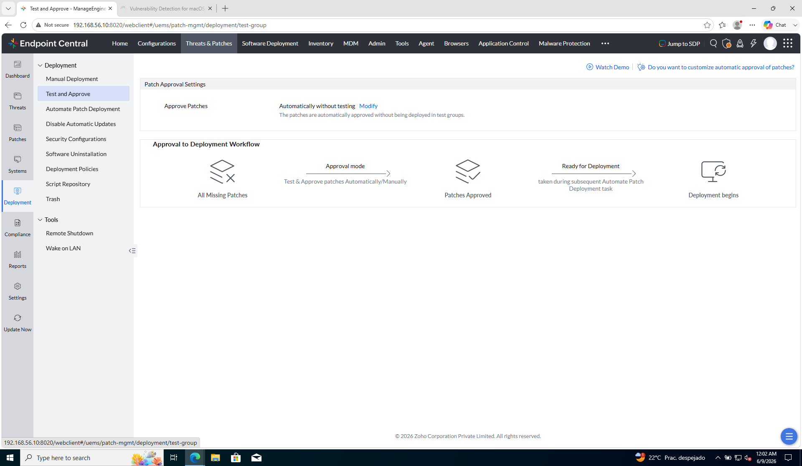

| En la captura | Qué implica |
|---------------|-------------|
| *Automatically without testing* seleccionado | Missing y Approved casi colapsan — acelera el lab |
| Flujo sin **Create Test Groups** | No hay paso intermedio de prueba en el diagrama |
| **Modify** visible | Mismo botón para pasar al **modo Test and Approve** |

---

#### B) Modificado — *Test and Approve* (modo curso)

Es el cambio que alinea EC con operación real: **probar en pocos → aprobar → desplegar al resto**.

| Qué es | Para qué sirve | En la práctica |
|--------|----------------|----------------|
| **Test and Approve** | Parches van primero a **test group(s)**; solo tras OK pasan a Approved para el parque | Canary / piloto de parches — mismo espíritu que `Grupo-Clientes` |
| **Mark Patch as Not Approved** (existing) | Al guardar, los parches ya detectados **pierden** approved (salvo Declined) | Reset limpio: no arrastras aprobaciones del modo automático |
| **Retain Approval Status** (alternativa) | Mantendría lo ya aprobado al cambiar de modo | Útil en migraciones; en lab preferimos reset para ver el flujo entero |
| Diagrama con **Create Test Groups** | Missing → test group → tested → approved → deployment | `Grupo-Clientes` = candidato natural a test group **y** target del deploy piloto |

**Referencia — modo modificado (enterprise):**

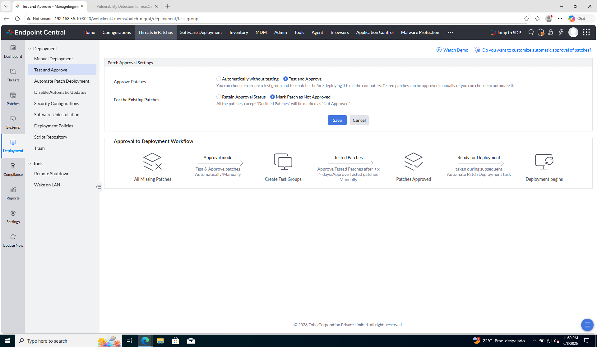

| En la captura | Qué implica |
|---------------|-------------|
| **Test and Approve** seleccionado | Cada parche nuevo debe pasar por fase de prueba antes de producción |
| **Mark Patch as Not Approved** | Tras **Save**, revisa Missing/Applicable — verás parches **not approved** |
| **Create Test Groups** en el diagrama | Configuras **qué grupos** son test (segmentación aquí, no en el radio global) |
| **Tested Patches → Approve … Manually / after X days** | CAB simplificado: tú apruebas o EC tras plazo si el test no falló |
| **Save / Cancel** | Sin Save no aplica — la política global no cambia hasta confirmar |

#### C) Test Group Deployment (formulario completo)

La política **Test and Approve** habilita test groups; esta pantalla es **dónde** defines el piloto: a **qué grupo**, **qué parches**, **cuándo** desplegar en test y **cómo** pasan a Approved.

```
Test and Approve → Test group settings → Test Group Deployment
```

Captura en **portrait** (scroll) para ver el formulario de arriba abajo.

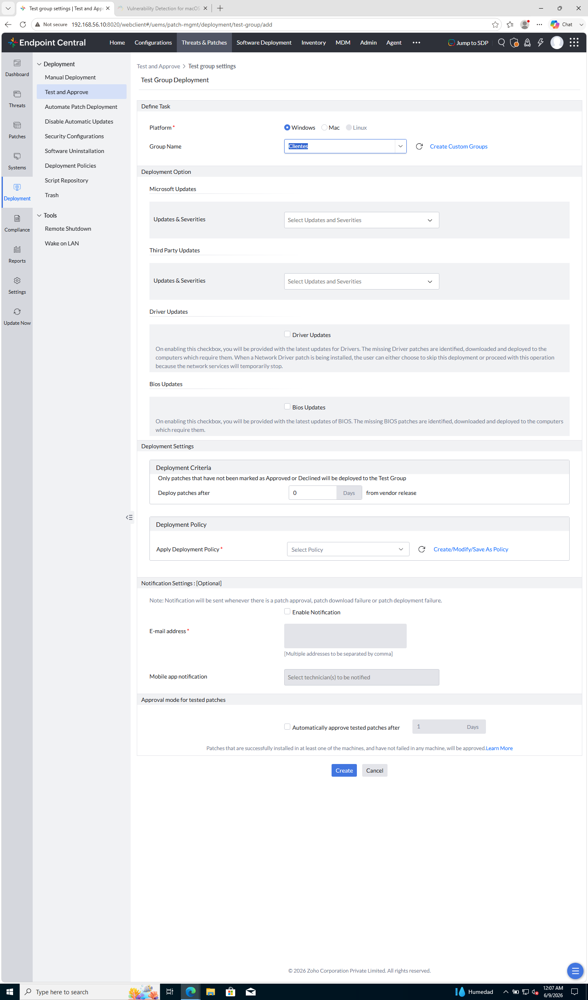

---

##### 1. Define Task — ¿a quién afecta?

| Campo | Qué es | En la práctica |
|-------|--------|----------------|
| **Platform** (Windows / Mac / Linux) | Una tarea de test group **por plataforma** | En el lab: **Windows** — `ec-client1` y clientes Windows |
| **Group Name** | Custom Group que actúa como **test group** | Selecciona **`Grupo-Clientes`** (en piloto puede aparecer como *Clientes*) — solo clientes, no `ec-server` |
| **Create Custom Groups** | Enlace a M3 si el grupo no existe | Reutilizas la segmentación de parque; no creas un grupo test aparte salvo que quieras en producción |

---

##### 2. Deployment Option — ¿qué parches entran en el test?

| Campo | Qué es | En la práctica |
|-------|--------|----------------|
| **Microsoft Updates → Updates & Severities** | Filtro de parches Microsoft por severidad | En lab: Critical + Important suele bastar |
| **Third Party Updates → Updates & Severities** | Parches de terceros (7-Zip, runtimes…) | Activa si quieres probar lo visto en Missing (WebView2, .NET…) |
| **Driver Updates** (checkbox) | Incluye drivers en el test | Desactivado en lab — pueden cortar red momentáneamente |
| **BIOS Updates** (checkbox) | Incluye BIOS en el test | Desactivado en lab — reboot más delicado |

---

##### 3. Deployment Settings — ¿cuándo y con qué reglas?

| Campo | Qué es | En la práctica |
|-------|--------|----------------|
| Texto *not Approved or Declined* | Solo parches **sin decisión** entran al test | Coherente con *Mark Patch as Not Approved* del paso B |
| **Deploy patches after [0] Days from vendor release** | Espera N días tras publicación del fabricante | **0** en lab; en prod a veces 3–7 días de soak |
| **Apply Deployment Policy** | Ventana, reboot, aviso al usuario (M4-03) | El **cuándo** del test = la policy que elijas |
| **Create / Modify / Save As Policy** | CRUD de políticas | M4-03 profundiza aquí |

---

##### 4. Notification Settings (optional)

| Campo | Qué es | En la práctica |
|-------|--------|----------------|
| **Enable Notification** | Alertas email/app en hitos del test | Opcional en lab |
| **E-mail address** | Destinatarios | Mailpit (M3) si pruebas correo |
| **Mobile app notification** | Técnicos en app EC | Referencia — no obligatorio |

---

##### 5. Approval mode for tested patches

| Campo | Qué es | En la práctica |
|-------|--------|----------------|
| **Automatically approve tested patches after [1] Days** | Tras test OK, auto-approve tras N días | **1 día** en piloto — CAB automático tras soak |
| Nota inferior | ≥1 PC OK y **0 failures** en test group | Si `ec-client1` falla, no se auto-aprueba |

Casilla desmarcada = approve **manual**; marcada = auto tras N días sin fallos.

---

##### Acciones

| Botón | Qué hace |
|-------|----------|
| **Create** | Guarda la tarea — inicia ciclo test → approve |
| **Cancel** | Descarta cambios |

**Valores lab:** Windows · **Grupo-Clientes** · Microsoft Critical/Important · sin drivers/BIOS · policy de lab · auto-approve 1 día (o manual).

Política global en B); **grupo + severidades + policy + plazo approve** en este formulario.

#### D) Tras Create — Test Groups en la consola

Al volver a **Test and Approve**, la sección **Test Groups** lista los grupos de prueba ya configurados — cada tarjeta es un test group activo.

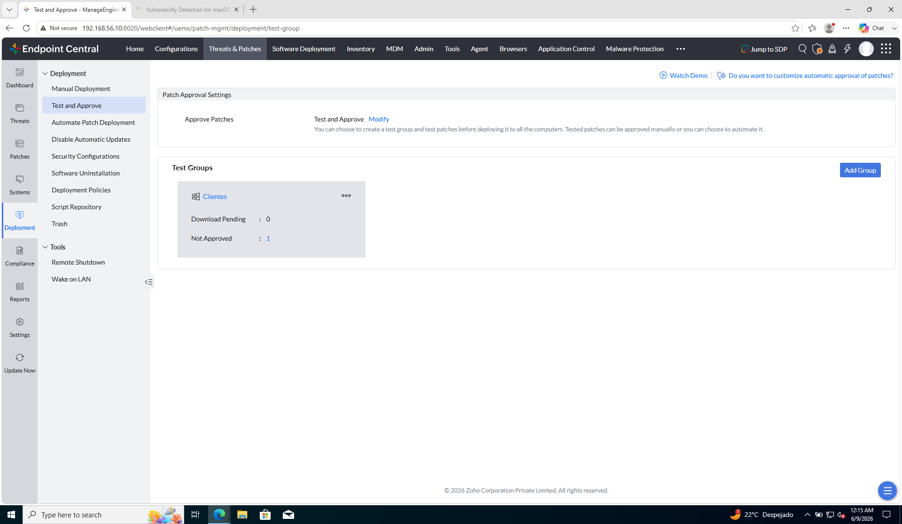

| En la captura | Qué es | En la práctica |
|---------------|--------|----------------|
| **Test and Approve** (cabecera) | Política global *Test and Approve* — coherente con el formulario | Confirmas que no volviste a *Automatically without testing* |
| Tarjeta **Clientes** | Test group = **`Grupo-Clientes`** del lab M3 | Mismo grupo: scope, test y deploy |
| **Download Pending: 0** | Parches aún no descargados al servidor EC para este test | Si >0, EC está trayendo binarios antes del deploy test |
| **Not Approved: 1** | Parches en fase test / pendientes de approve en este grupo | Tras test OK pasan a Approved para el resto del parque |
| **Add Group** | Añade otro test group (otra plataforma u otro segmento) | P. ej. Mac test group aparte del Windows **Clientes** |
| Menú **⋯** en la tarjeta | Editar / eliminar configuración del test group | Reabre el formulario del paso C |

#### Contraste rápido

| | **A) Automático** | **B) Test and Approve** |
|---|-------------------|-------------------------|
| Missing → Approved | Casi directo | Vía test group |
| Grupo piloto M3 | Opcional para deploy | **Relevante** también como test group |
| Riesgo operativo | Mayor si deploy apunta mal | Menor — pruebas acotadas primero |
| Lab M4 | Válido para ir rápido | **Recomendado** para contar la historia enterprise |

**Comprueba:** entiendes que **Approve** es gobierno **global**, que la **segmentación** va por **grupos test + target de deploy**, y que **Missing ≠ Approved ≠ Installed**.

---

### Paso 2 — Revisar parches tras la política

En M4-01 viste **Missing Patches** para **detectar**. Aquí vuelves a la **misma pantalla** con otra pregunta: tras cambiar la política a *Test and Approve*, **¿qué parches están bloqueados para deploy y cuáles elegirías para el piloto?**

| Qué es | Para qué sirve | En la práctica |
|--------|----------------|----------------|
| **Missing Patches** (otra vez) | Catálogo de parches detectados **no instalados** | M4-01: «¿qué falta?» — M4-02: «¿qué falta **y** qué estado de approve tiene?» |
| **Approve Status: Not Approved** | El parche está **detectado** pero **no autorizado** para despliegue amplio | Normal tras *Mark Patch as Not Approved* en paso 1B |
| **Install/Publish Patches** (botones arriba) | Acción masiva de instalación | **No pulses aún** — en el curso primero test group + policy (M4-03) + manual deploy (M4-04) |
| **Decline** | Excluir un parche concreto del ciclo | Producción: KB problemático; lab: referencia |

```
Threats & Patches → Patches → Missing Patches
```

**Referencia — Missing Patches con approve status (piloto):**

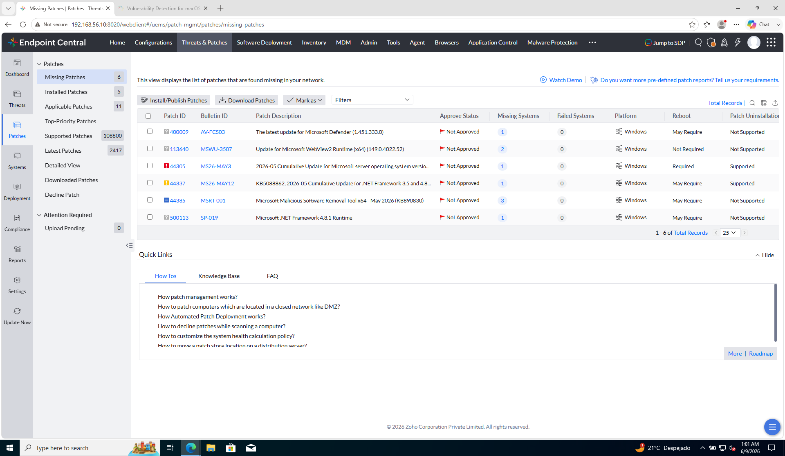

| En la captura | Qué es | En la práctica |
|---------------|--------|----------------|
| Sidebar **Missing Patches (6–7)** | Parches distintos missing en el parque | No confundir con «2 missing» de **Systems** en `ec-client1` — aqui es **por parche**, no por PC |
| **Approve Status → Not Approved** (bandera roja) | Ninguno autorizado para deploy masivo todavía | Coherente con *Test and Approve*: hace falta **test en Clientes** y/o approve manual |
| **Missing Systems** (1, 2 o 3) | Cuántos PCs necesitan **ese** parche | Clic en el número → ves si incluye `ec-client1` |
| Defender / WebView2 / .NET / 7-Zip… | Mix Microsoft + terceros | No son solo KBs de Windows Update — EC incluye terceros del inventario |
| **Install/Publish · Download · Mark as** | Acciones sobre filas seleccionadas | En el paso 2 solo **observas**; el deploy guiado viene en el paso 3 y M4-04 |

**Referencia — detalle al pulsar Missing Systems:**

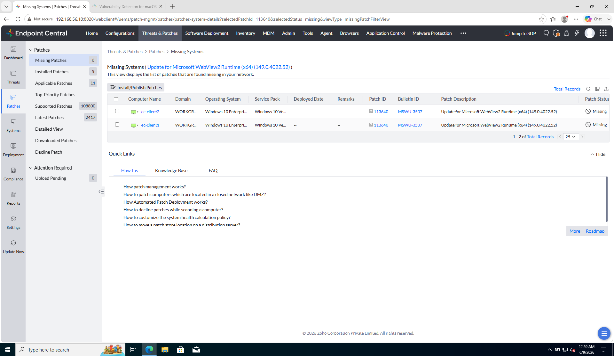

| En la captura | Qué es | En la práctica |
|---------------|--------|----------------|
| **Missing Systems (WebView2…)** | Vista tras clic en el número azul de la columna | Lista **ec-client1**, **ec-client2**, etc. que necesitan **ese** parche |
| **Patch Status: Missing** | Aún no instalado en ese PC | Confirma alcance antes de test/deploy en **Grupo-Clientes** |

#### M4-01 vs M4-02 — misma pantalla, distinto foco

| | **M4-01 paso 3** | **M4-02 paso 2** |
|---|------------------|------------------|
| Pregunta | «¿Qué parches faltan en el parque?» | «¿Cuáles están **Not Approved** y cuáles uso en el piloto?» |
| Acción | Anotar Patch ID, Missing Systems | Elegir 2–5 candidatos para test/deploy en **Clientes** |
| Botón Install | Ignorar (aún no) | Seguir ignorando — M4-04 |

#### Qué hacer en este paso (sin desplegar)

Dos pantallas seguidas — no pulses **Install/Publish** en ninguna.

**A) Missing Patches** (primera captura)

1. Confirma **Approve Status** = **Not Approved** en todas las filas.
2. Elige **2–5 parches** para el lab (Microsoft / Defender / .NET / WebView2…; evita acumulativos enormes la primera vez).
3. Anota **Patch ID** y **Bulletin ID** de al menos uno.

**B) Missing Systems** (segunda captura — tras pulsar el número azul de un parche en A)

4. Comprueba que **`ec-client1`** aparece en la tabla (estado **Missing**).
5. Vuelve atrás a **Missing Patches** (breadcrumb o sidebar). **No despliegues** desde aquí.

**Comprueba:** Not Approved en la lista; `ec-client1` visto en el detalle de al menos un parche; un Patch ID anotado.

→ **Paso 3**

---

### Paso 3 — Instalar parche de prueba en Clientes

**Por qué:** en el paso 1 definiste que los parches se **prueban primero** en **Clientes** (`ec-client1`) antes de autorizarlos para el parque. Aquí **lanzas** esa prueba y compruebas que termina bien.

**Prerrequisito:** tarjeta **Clientes** visible en **Test and Approve** (paso 1, apartado D).

#### 3.1 — Lanzar el test (acción en consola)

En producción el test group puede desplegar **solo**, tras un plazo o en un ciclo programado. **En este ejemplo** lanzamos el deploy **a mano** para ver el resultado al momento y poder seguir con los pasos 4 y M4-04.

```
Threats & Patches → Patches → Missing Patches
```

1. Selecciona **1 parche** (uno de los que anotaste en el paso 2).
2. Pulsa **Install/Publish Patches**.
3. En el asistente, **target = Custom Group → Grupo-Clientes** (o *Clientes*). **No** elijas All Computers.
4. Confirma / **Deploy**.

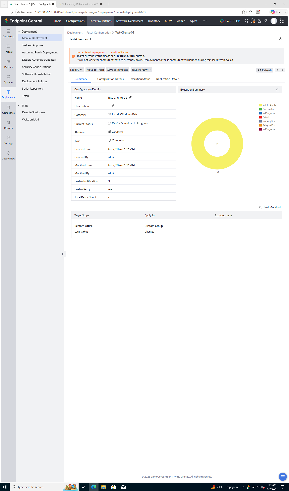

El asistente es el formulario **Install/Uninstall Windows Patch (Computer)**. Aquí lo usas para el **test** a **Clientes** con parche **Not Approved**.

##### Name

| Campo | Qué es | En este ejemplo |
|-------|--------|-----------------|
| **Name** | Nombre de la tarea en EC (aparece en Deployment Status) | `Test-Clientes-01` o el que proponga la consola |

##### 1. Install Patch

| Campo | Qué es | En este ejemplo |
|-------|--------|-----------------|
| **Operation Type → Install Patch** | Instalar (no desinstalar) | Deja **Install Patch** |
| Tabla de parches | Los KB que elegiste en Missing Patches | **1 parche** — p. ej. WebView2 **113640** |
| **Approve Status: Not Approved** | El parche aún no está autorizado para todo el parque | **Normal** en paso 3 — el approve es el paso 4 |
| **Missing Systems** | Cuántos PCs lo necesitan | Informativo; no cambia el target |
| **+ Add More Patches** | Añadir más filas | En este ejemplo deja **solo 1** |

##### 2. Deployment Settings

| Campo | Qué es | En este ejemplo |
|-------|--------|-----------------|
| **Deploy** (radio) | Crear tarea de instalación | Selecciona **Deploy** |
| **Apply Deployment Policy** | Cuándo instala y si hay reboot (M4-03) | Elige una policy — p. ej. *Deploy any time at the earliest* o `Lab-Pilot-Deploy` |
| **Publish to Self Service Portal (SSP)** | El usuario final puede instalar desde portal | **No** |
| **Force deploy to unpatched systems after** | Fecha límite para forzar en PCs que aún no lo tienen | Déjalo vacío |

##### 3. Define Target

| Campo | Qué es | En este ejemplo |
|-------|--------|-----------------|
| **Target 1** | Primer alcance de equipos | **Custom Group** → **`Grupo-Clientes`** (o *Clientes*) |
| Filtro por equipo suelto | Un hostname concreto | **No** uses solo `ec-client2` — el piloto del lab es el **grupo** de M3 |
| **All Computers** | Todo el parque | **No** — solo clientes del grupo piloto |

##### 4. Execution Settings (optional)

| Campo | Qué es | En este ejemplo |
|-------|--------|-----------------|
| **Retry … on failed targets** | Reintenta si falla en un PC | Deja marcado (valores por defecto suelen valer) |
| **Install After** / ventana | Programar instalación más tarde | Desmarcado — quieres resultado ya |
| **Continue deployment even if some patches cannot be downloaded** | Sigue aunque falte binario en el servidor | Marcado suele estar bien |

##### Acciones (pie del formulario)

| Botón | Qué hace | En este ejemplo |
|-------|----------|-----------------|
| **Deploy Immediately** | Lanza la tarea **ya** (si la policy lo permite) | **Usa este** para no esperar ventana |
| **Deploy** | Crea la tarea según policy (puede quedar Scheduled) | Alternativa si no hay Deploy Immediately |
| **Save As** | Guarda plantilla sin desplegar | No necesario aquí |
| **Cancel** | Descarta | — |

**Resumen de valores clave:** 1 parche · target **Grupo-Clientes** · policy con instalación temprana · **Deploy Immediately**.

#### 3.2 — En `ec-client1`

Puede aparecer **Patch Update Notification** → **Start Now**. La instalación es **en segundo plano** (sin Windows Update visible). Si no hay aviso, el agente instala igual.

#### 3.3 — Comprobar resultado

```
Threats & Patches → Deployment → Deployment Status
```

| Qué debes ver | Significado |
|---------------|-------------|
| **Success** / **Installed** en **ec-client1** | Prueba OK → **paso 4** |
| **In Progress** / **Scheduled** | Espera 2–5 min y refresca (F5) |

Referencia — resultado en consola:

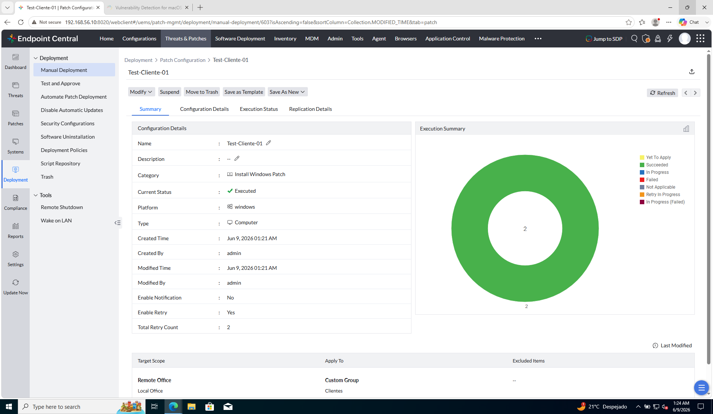

Comprobación alternativa: **Systems → ec-client1** — el contador **missing** baja.

#### 3.4 — Qué debes ver y qué no

| Debes ver | No debes esperar |
|-----------|------------------|
| **Success** en Deployment Status | **Approved** en Missing Patches — eso es el **paso 4** |
| Parche testeado sigue **Not Approved** | Ventana llamativa de Windows Update en el cliente |

Si el estado es **Failed**, no continúes al paso 4 — revisa [M4-05](05-escalado-y-remediacion.md).

**Comprueba:** **Success** / **Executed** en la tarea (p. ej. **Test-Cliente-01**).

> Tras el paso 3, **Missing Patches** sigue mostrando **Not Approved** — es correcto. La instalación no sustituye al paso 4.

→ **Paso 4**

---

### Paso 4 — Aprobar el parche testeado

**Por qué:** instalar en el piloto **no** autoriza el parche para todo el parque. El paso 4 simula la decisión de CAB: marcar el parche como **Approved** tras una prueba sin fallos.

**Qué parche:** el de **Test-Cliente-01** (paso 3) — en el piloto suele ser **113640** (WebView2). Si no lo recuerdas: **Manual Deployment** → abre la tarea → **Configuration Details**.

#### Dónde está el parche tras instalarlo

Tras el paso 3, el parche **ya no aparece en Missing Patches** (dejó de estar *missing* en Clientes). Apruébalo en otra vista:

| Vista | Ruta |
|-------|------|
| **A — Applicable Patches** | `Patches → Applicable Patches` → filtra **Approve Status: Not Approved** |
| **B — Installed Patches** | `Patches → Installed Patches` → busca **113640** / WebView2 → **Mark as → Approved** |
| **C — Missing Patches** | Solo si la fila **sigue** en Missing (parque mixto: instalado en Clientes, missing en otros) |
| **D — Tarea del paso 3** | **Manual Deployment → Test-Cliente-01 → Configuration Details** → parche en tabla → **Mark as → Approved** |

En este ejemplo valen **A**, **B** o **D**.

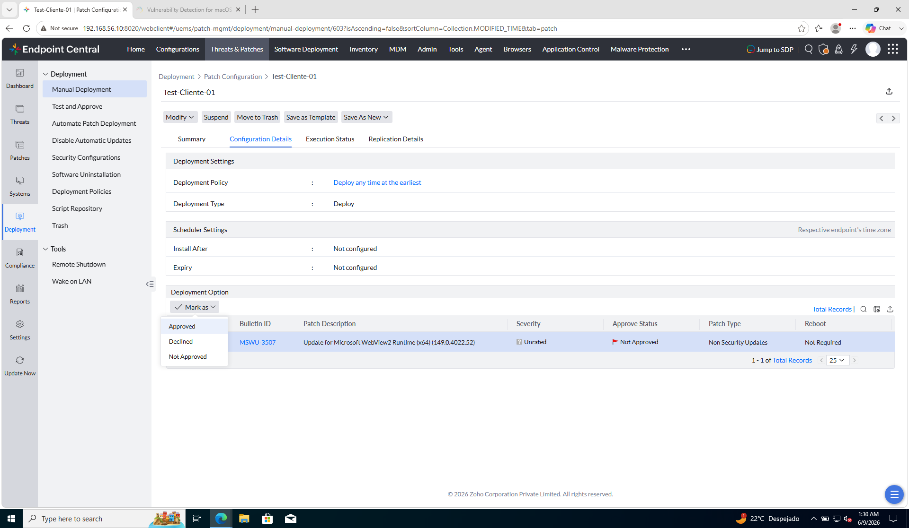

#### Acción

1. Localiza el parche (**113640** o el de Test-Cliente-01).
2. Selecciona la fila → **Mark as** → **Approved**.
3. Refresca.

| Antes (paso 3) | Después (paso 4) |
|----------------|------------------|
| Instalado en Clientes, **Not Approved** | **Approved** — ya elegible en M4-04 **+ Add Patches** |

Referencia — parche **Approved** tras el paso 4:

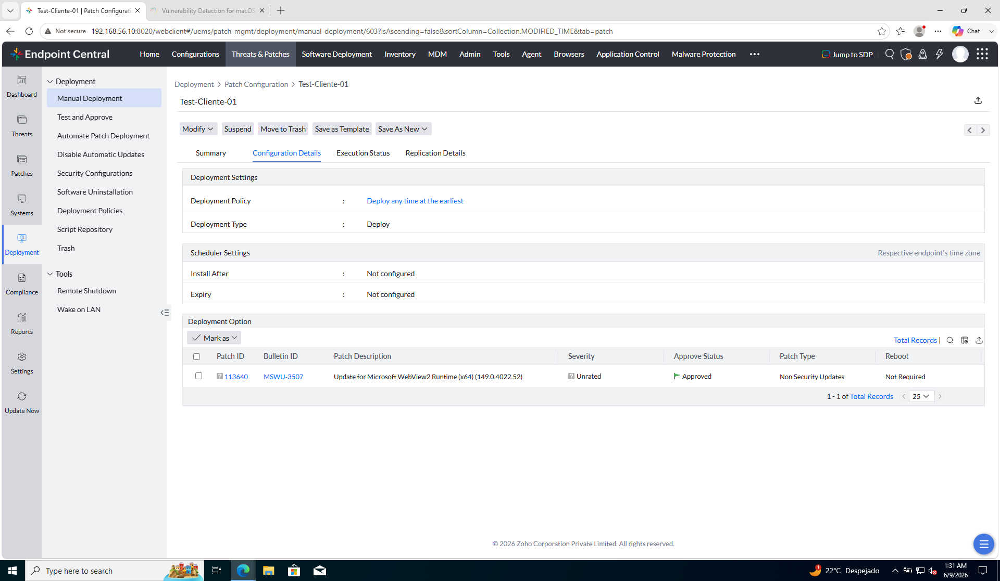

**Comprueba:** el parche testeado figura **Approved** (en Applicable, Installed o Missing).

→ **Paso 5**

---

### Paso 5 — Verificar grupo piloto

El grupo de M3 cumple **dos roles** distintos con la misma lista de miembros:

| Rol | Para qué en M4 |
|-----|----------------|
| **Test group** (*Test and Approve*) | Primer destino del parche en fase de prueba |
| **Target de deploy** (M4-04) | Donde instalas tras aprobar |

```
Admin → Custom Group → Grupo-Clientes
```

| Comprobar | Valor esperado |
|-----------|----------------|
| Nombre | **`Grupo-Clientes`** |
| Miembros | **`ec-client1`** |
| `ec-server` | Fuera del grupo piloto |

**Referencia — grupo piloto:**

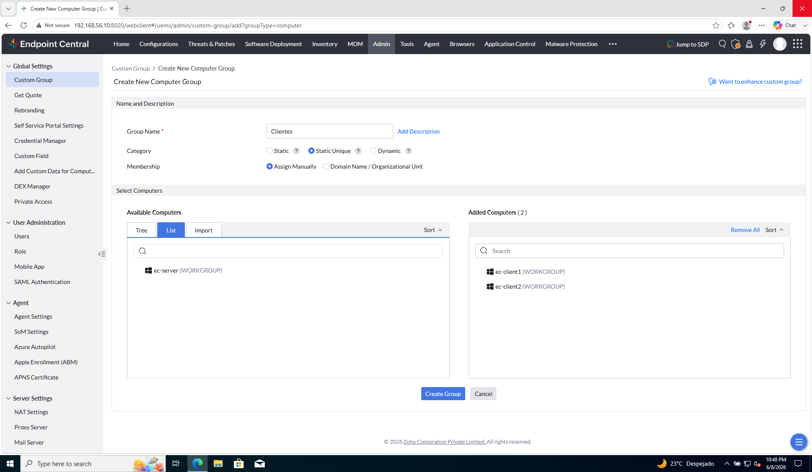

(captura compartida M3 / M4 — mismo objeto de parque)

---

### Paso 6 — Verificar coherencia

| Pregunta | Respuesta esperada |
|----------|-------------------|
| ¿La política de aprobación es global? | Sí — un modo para todo el servidor EC |
| ¿Dónde segmentas el parque? | Test groups, target de deploy, Decline, Deployment Policies |
| ¿Existe `Grupo-Clientes` con solo el cliente? | Sí |
| ¿Por qué no desplegar a All Computers ya? | Riesgo de reboot masivo / sin fase test |

---

## Antes de seguir

Has separado **gobierno global** (Test and Approve) de **alcance segmentado** (grupos, targets, políticas).

### Pon el foco en

- **Política global** = cómo entra un parche a Approved; **grupos** = dónde pruebas e instalas.
- ***Automatically without testing*** acelera labs; ***Test and Approve*** cuenta la historia enterprise — el curso usa **Test and Approve**.
- **Grupo-Clientes** = mismo objeto para scope usuario (M3), test group y deploy (M4).

→ **[M4-03 — Ventana de mantenimiento](03-ventana-de-mantenimiento.md)**
