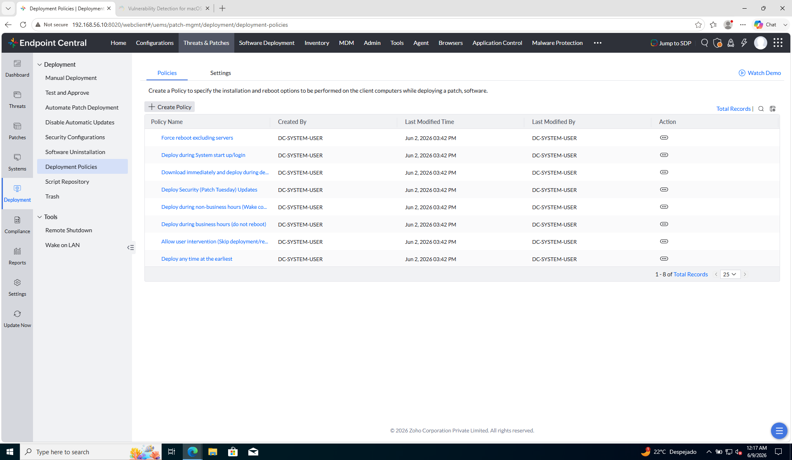
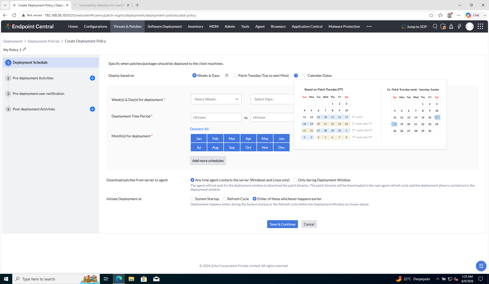
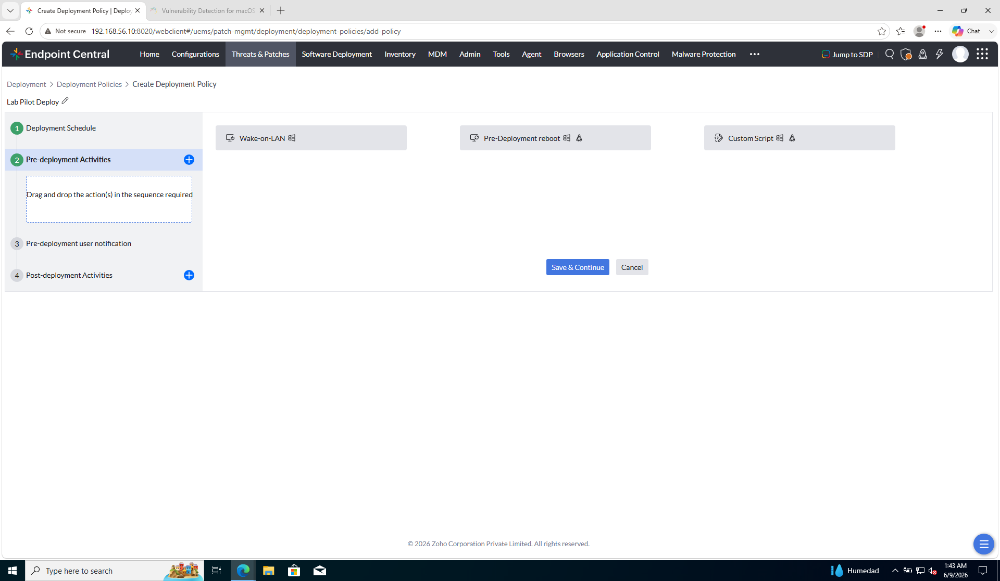
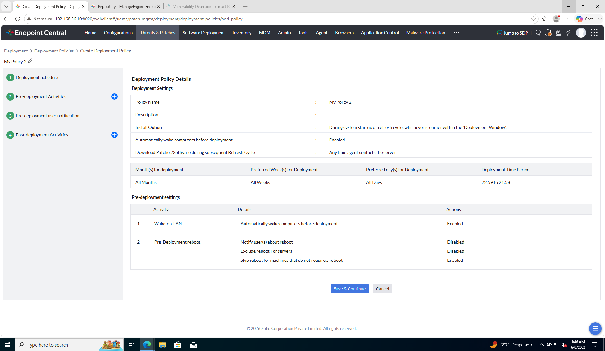
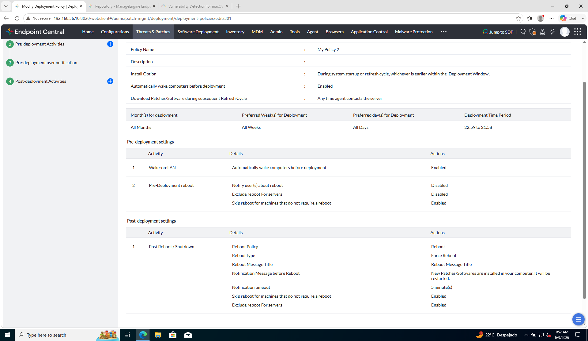

# Laboratorio M4-03 — Ventana de mantenimiento

[← M4-02](02-aprobacion-y-grupo-piloto.md) · [M4](README.md) · [Siguiente: M4-04 →](04-despliegue-piloto.md)

Objetivo: entender las **Deployment Policies** — **cuándo** y **cómo** (reboot, aviso) se instalan parches — y elegir o crear una para el piloto.

---

### Paso 1 — Deployment Policies

Tras definir test group y aprobación (M4-02), falta el **contrato operativo** con el negocio: en qué franja se instala, si hay reboot y si el usuario recibe aviso. Eso vive en **políticas de despliegue reutilizables**.

| Qué es | Para qué sirve | En la práctica |
|--------|----------------|----------------|
| **Deployment Policy** | Plantilla de **install + reboot + notificación** | La asocias a test group, manual deploy o APD — no reconfiguras cada vez |
| Lista de policies | Catálogo predefinido + las tuyas | EC trae defaults (business hours, Patch Tuesday, force reboot excluding servers…) |
| **Settings** (pestaña) | Ajustes globales del módulo deployment | Complemento; el lab usa sobre todo **Policies** |

```
Threats & Patches → Deployment → Deployment Policies
```

**Referencia — listado de policies:**



| En la captura | Qué es | En la práctica |
|---------------|--------|----------------|
| Pestaña **Policies** | Listado de plantillas disponibles | Eliges una al crear test group (M4-02) o manual deploy (M4-04) |
| **+ Create Policy** | Alta de policy propia | En lab: `Lab-Pilot-Deploy` con ventana acorde al curso |
| *Deploy during non-business hours (Wake co…)* | Ventana fuera de horario + wake-on-LAN | Estándar enterprise — no molesta al usuario |
| *Deploy during business hours (do not reboot)* | Instala en horario laboral sin reinicio | Parches que no requieren reboot o aplazas restart |
| *Deploy any time at the earliest* | En cuanto el agente pueda | **Lab** con un solo cliente — aceptable en demo |
| *Force reboot excluding servers* | Reinicio forzado salvo servidores | Producción con cuidado — nunca a ciegas en horario pico |
| *Deploy Security (Patch Tuesday) Updates* | Orientada a actualizaciones de seguridad mensuales | Automatización alineada con ciclo Microsoft |
| *Allow user intervention* | Usuario puede posponer/saltar | SSP / escritorios con usuario presente |
| Columna **Action (⋯)** | Editar / copiar / eliminar policy | **Save As** para clonar una default y ajustar |

**¿Global o segmentable?** La **policy** es un objeto reutilizable; **qué policy aplica a quién** lo decides al asociarla (test group, tarea manual, APD) — ahí segmentas el **cuándo/cómo**, no el modo Test and Approve.

---

### Paso 2 — Crear policy o reutilizar una existente

**Atajo para este ejemplo:** en el listado del paso 1 ya existe **Deploy any time at the earliest** — puedes usarla en M4-04 sin crear nada. El resto del paso describe **+ Create Policy** si quieres una policy propia (`Lab-Pilot-Deploy`).

```
Deployment → Deployment Policies → + Create Policy
```



El asistente tiene **cuatro pasos** en el lateral. La captura es el **paso 1**; reboot y avisos van en los pasos 3 y 4.

#### Paso 1 del asistente — Deployment Schedule

| Campo en el formulario | Qué es | En este ejemplo |
|------------------------|--------|-----------------|
| **Name** (arriba) | Nombre de la policy | `Lab-Pilot-Deploy` |
| **Deploy based on → Weeks & Days** | Ventana recurrente por semana/día | Opción más simple para el lab |
| **Deploy based on → Patch Tuesday (Tue to next Mon)** | Ventana alineada al ciclo Microsoft | Producción / Patch Tuesday |
| **Deploy based on → Calendar Dates** | Fechas concretas del calendario | Ventanas puntuales |
| **Week(s) & Day(s) for deployment** | Qué semanas del mes y qué días | Semana + día que incluya **hoy** |
| **Deployment Time Period** (HH:mm – HH:mm) | Franja horaria diaria de instalación | Ventana amplia (p. ej. 00:00–23:59) |
| **Month(s) for deployment** | Meses activos | Todos o el mes actual |
| **Add more schedules** | Varias ventanas en la misma policy | No necesario en el lab |
| **Download patches … → Any time agent contacts the server** | Descarga en refresh; instala en la ventana | Adecuado para el lab |
| **Download patches … → Only during Deployment Window** | Descarga e instala solo en ventana | Más restrictivo — producción |
| **Initiate Deployment at → System Startup** | Solo al arrancar el PC | PCs apagados fuera de ventana |
| **Initiate Deployment at → Refresh Cycle** | Cuando el agente contacta al servidor | Agentes online |
| **Initiate Deployment at → Either … whichever happens earlier** | Lo que ocurra antes dentro de la ventana | **Recomendado** en este ejemplo |

Pulsa **Save & Continue**.

#### Paso 2 del asistente — Pre-deployment Activities



| Acción disponible | Qué es | En este ejemplo |
|-------------------|--------|-----------------|
| **Wake-on-LAN** | Despierta el PC antes de instalar | Opcional si el cliente está apagado |
| **Pre-Deployment reboot** | Reinicio **antes** del parche | Solo si lo exige el escenario |
| **Custom Script** | Script previo a la instalación | Vacío — no arrastres nada al recuadro |

**Save & Continue** (sin arrastrar acciones, si no las necesitas).

Resumen tras los pasos 1–2 (si EC lo muestra):



---

### Paso 3 — Notificación al usuario (asistente, paso 3)

Tras **Save & Continue** del paso 2, el lateral marca **3. Pre-deployment user notification**.

**Qué hacer:**

1. Si quieres el popup como en `ec-client1` (paso 3 de M4-02) → activa **notificación al usuario** y deja los valores por defecto.
2. Si no necesitas demostrar el aviso → desactiva la notificación.
3. **Save & Continue**.

| Campo habitual | En este ejemplo |
|----------------|-----------------|
| Notificar antes de instalar | **Activado** (demo) o **Desactivado** (mínimo) |
| Posponer / remind | Por defecto |

No hay reboot aquí — solo aviso **antes** de instalar.

---

### Paso 4 — Reinicio tras instalar (asistente, paso 4)

El lateral marca **4. Post-deployment Activities**. Aquí configuras el **reboot después** del parche.



**Qué hacer:**

1. Arrastra **Post-Deployment reboot** (o equivalente) al recuadro de secuencia — si no lo necesitas, déjalo vacío y guarda.
2. En las opciones del reboot:

| Opción en el formulario | Qué implica | En este ejemplo |
|-------------------------|-------------|-----------------|
| **Reboot if required** / reiniciar si el parche lo exige | Estado coherente tras KB que pide restart | **Sí** |
| **Reboot type → Force Reboot** | Reinicio siempre | **No** en este ejemplo — usa reboot solo si el parche lo exige |
| **Notify user(s) about reboot** | Mensaje antes de reiniciar | Opcional (en captura: 5 min) |
| **Exclude reboot for servers** | No reinicia servidores | **Sí** |
| **Skip reboot** si no hace falta | Solo reinicia cuando el parche lo requiere | **Sí** |
| **Suppress reboot** / do not reboot | Instala y aplaza reinicio — **deuda técnica** | No en este ejemplo |

3. **Guardar** la policy.

**Comprueba:** `Lab-Pilot-Deploy` (o **My Policy 2**) aparece en el listado del paso 1.

**Atajo:** si no creas policy, usa **Deploy any time at the earliest** del listado y salta al paso 5.

---

### Paso 5 — Aplicar la policy a una tarea

La policy **no se aplica a un grupo** — se aplica a una **tarea de despliegue** (configuración). El **grupo** es el **target** dentro de esa tarea.

| Concepto | Qué es | Dónde se configura |
|----------|--------|-------------------|
| **Deployment Policy** | Plantilla: cuándo instala, reboot, avisos | Desplegable **Apply Deployment Policy** en la **tarea** |
| **Target (Grupo-Clientes)** | A **quién** va el parche | **Define Target** en la **misma tarea** |
| **Custom Group (M3)** | Lista de PCs del parque | Admin → Groups — no es donde eliges la policy |

**No vas a Admin → Groups** en este paso (`Grupo-Clientes` ya lo validaste en M4-02 paso 5).

En [M4-04](04-despliegue-piloto.md) crearás una tarea en **Manual Deployment** con:

1. **Apply Deployment Policy** → policy del listado
2. **Define Target** → **Custom Group → Grupo-Clientes**
3. **+ Add Patches** → parches **Approved**

| Pantalla | Qué defines |
|----------|-------------|
| **Manual Deployment** | Tarea = policy + parches + target |
| **Test Group Deployment** | Tarea del grupo de prueba (M4-02) |
| **Deployment Policies** | Catálogo de plantillas — no despliega solo |

**Comprueba:** la policy se elige en **Apply Deployment Policy** de la tarea, no en Admin → Groups.

→ **[M4-04 — Despliegue piloto](04-despliegue-piloto.md)**
