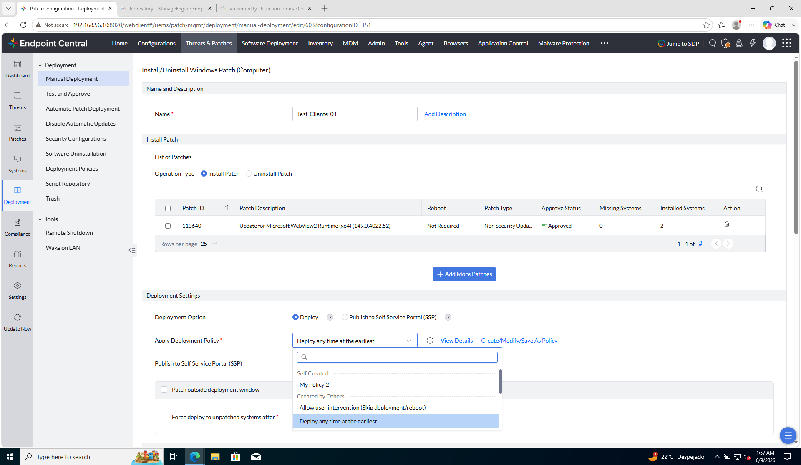
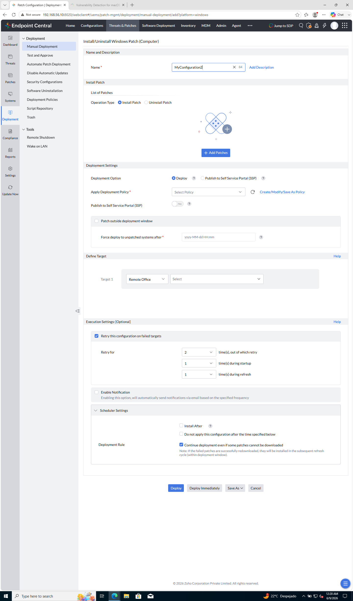

# Laboratorio M4-04 — Despliegue piloto

[← M4-03](03-ventana-de-mantenimiento.md) · [M4](README.md) · [Siguiente: M4-05 →](05-escalado-y-remediacion.md)

Objetivo: crear una **tarea de Manual Deployment** con parches **Approved**, aplicar una **deployment policy** y limitar el **target** a **`Grupo-Clientes`**.

### Flujo del ejercicio

| Paso | Ruta | Acción | Debes ver al terminar |
|------|------|--------|------------------------|
| **1** | Deployment → **Manual Deployment** | Abrir formulario nuevo | **Install/Uninstall Windows Patch (Computer)** |
| **2** | **+ Add Patches** | Elegir parches **Approved** | 1–3 filas en la tabla |
| **3** | **Deployment Settings** | **Apply Deployment Policy** | Policy seleccionada (no *Select Policy*) |
| **4** | **Define Target** | **Custom Group → Grupo-Clientes** | Target 1 = grupo piloto |
| **5** | **Deploy Immediately** → **Execution Status** | Lanzar y refrescar | **Succeeded** en clientes del grupo |

**Prerrequisitos del módulo:** al menos un parche **Approved** en catálogo; **`Grupo-Clientes`** con miembros; una policy en el listado (M4-03 o *Deploy any time at the earliest*).

---

### Paso 1 — Abrir Manual Deployment

**Manual Deployment** es la tarea puntual: parches + policy + target. No confundir con **Deployment Policies** (solo catálogo de plantillas).

```
Threats & Patches → Deployment → Manual Deployment
```

Pulsa la acción que abre un **formulario nuevo** (no el resumen de una tarea antigua).

| Qué | A qué se aplica |
|-----|-----------------|
| **Deployment Policy** | A la **tarea** — **Apply Deployment Policy** |
| **Grupo-Clientes** | Al **target** — **Define Target** |



Formulario completo (portrait):



**Comprueba:** ruta **Manual Deployment**, no Policies ni Test Group Deployment.

---

### Paso 2 — Parches Approved

En **Install Patch → + Add Patches**:

| Criterio | Valor |
|----------|--------|
| Cantidad | 1–3 parches |
| **Approve Status** | **Approved** |
| Excluir | Parches **Declined** o **Not Approved** |

Si el selector sale vacío, aprueba al menos un parche en **Applicable Patches** o **Installed Patches** antes de continuar.

**Comprueba:** cada fila de la tabla muestra **Approved**.

---

### Paso 3 — Deployment policy

En **Deployment Settings**:

| Campo | Valor |
|-------|--------|
| **Deploy** | Marcado (instalar, no desinstalar) |
| **Apply Deployment Policy** | **My Policy 2**, **Lab-Pilot-Deploy** o **Deploy any time at the earliest** |
| **View Details** | Confirma ventana y reboot de la policy elegida |

La policy define **cuándo** y **cómo** (reboot); no define **a quién** va el parche.

**Comprueba:** el desplegable ya no dice *Select Policy*.

---

### Paso 4 — Target y nombre de tarea

| Campo | Valor |
|-------|--------|
| **Name** | `Pilot-Deploy-Lab-01` |
| **Define Target → Target 1** | **Custom Group** → **`Grupo-Clientes`** |
| **All Computers** | No usar |

**Retry** y **Notification** pueden quedar por defecto.

**Comprueba:** el target es el grupo piloto; `ec-server` queda fuera del alcance.

---

### Paso 5 — Lanzar y seguir estados

| Acción | Detalle |
|--------|---------|
| Lanzar | **Deploy Immediately** (si la policy lo permite) o **Deploy** |
| Seguimiento | Misma tarea → **Execution Status**, o **Deployment → Deployment Status** |


Refresca cada 1–2 min hasta ver resultado estable:

| Estado | Significado |
|--------|-------------|
| **Scheduled** | Esperando ventana de la policy |
| **In Progress** / **Downloading** | Agente en curso |
| **Succeeded** / **Installed** | Parche aplicado en ese PC |
| **Failed** | Ver [M4-05](05-escalado-y-remediacion.md) |
| **Reboot Required** | Instalado; falta reinicio |

**Comprueba:**

| Campo en la tarea | Valor esperado |
|-------------------|----------------|
| **Execution Status** | **Succeeded** en clientes de `Grupo-Clientes` |
| **Apply Deployment Policy** | Policy elegida (no *Select Policy*) |
| **Define Target** | **Custom Group → Grupo-Clientes** |
| Nombre en listado | `Pilot-Deploy-Lab-01` (o el que hayas puesto) |

→ **[M4-05 — Escalado y remediación](05-escalado-y-remediacion.md)**
