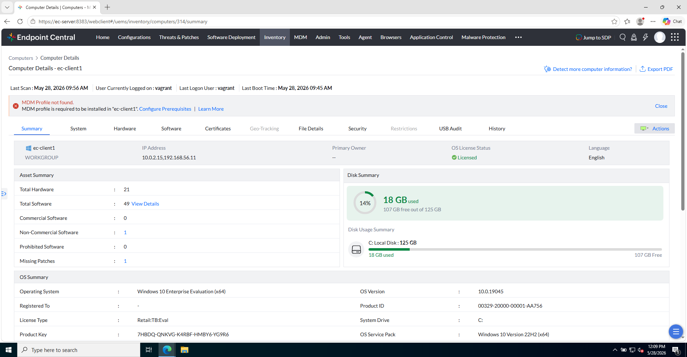
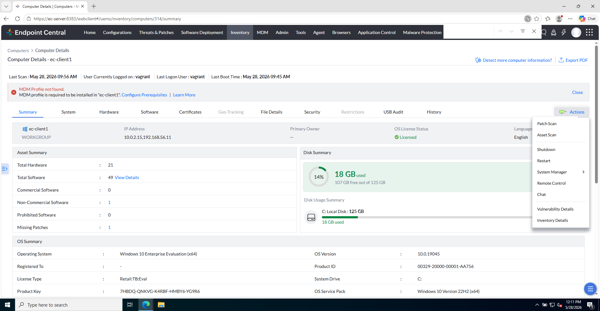
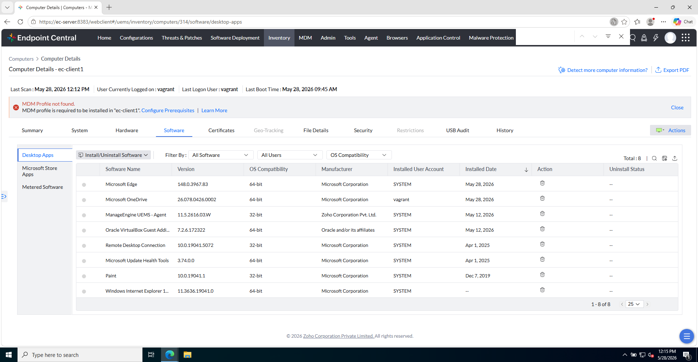
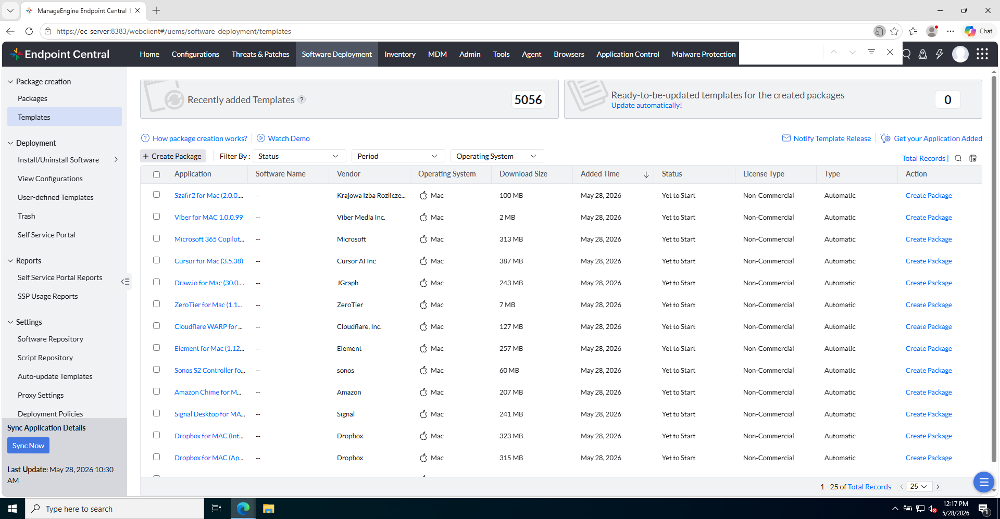

# Laboratorio M6-01 — Templates y package

[← M6](README.md) · [Siguiente: M6-02 →](02-configurar-despliegue.md)

Objetivo: entrar en **Software Deployment**, usar un **template** y crear el package `Chrome-Lab`.

---

### Paso 1 — Abrir Software Deployment

Menú lateral:

```
Software Deployment
```

**Referencia — módulo Software Deployment:**



---

### Paso 2 — Templates (marketplace)

Ve a **Templates** (plantillas predefinidas de aplicaciones habituales).

**Referencia:**



Busca **Google Chrome** (o el navegador indicado en tu versión).

---

### Paso 3 — Crear package desde template

Selecciona el template de Chrome y crea un **package**.

- **Nombre sugerido:** `Chrome-Lab`
- Revisa versión/arquitectura (64 bits, idioma) según el cliente de lab.

**Referencia — package creado:**



---

### Paso 4 — Revisar Actions del package

Abre el package y localiza **Actions**. Verás opciones de instalación/desinstalación.

**Referencia — menú Actions:**



**Fíjate en la diferencia:**

| Acción | Efecto |
|--------|--------|
| **Install Software — Computer** | Instala en el contexto del **equipo** (todos los usuarios del PC) |
| **Install Software — User** | Instala para el **usuario** con sesión / contexto de usuario |

Para este lab usaremos **Install Software — Computer** en el siguiente ejercicio.

---

### Paso 5 — Comprueba

- Package `Chrome-Lab` existe y está asociado al template.
- Entiendes qué acción usarás para desplegar.

---

## Antes de seguir

Has separado tres capas: **template** (receta), **package** (tu unidad) y **acción** (instalar/desinstalar).

### Pon el foco en

- El template ahorra tiempo; el package es lo que **despliegas** con nombre y versión concretos.
- **Install — Computer** vs **Install — User** cambia **dónde** queda la app (todo el PC vs usuario concreto).
- En el siguiente ejercicio configurarás **policy y target** — ahí suelen estar los errores de producción.

### Preguntas de cierre

1. Sin desplegar aún, explora otro template del marketplace: ¿qué campos rellena automáticamente respecto a un package manual?
2. ¿Instalarías un antivirus con **Install — User** o **Install — Computer**? Justifica.
3. Abre **Actions** otra vez y cuenta cuántas opciones hay además de instalar: ¿cuál podría ser peligrosa en horario laboral?

→ **[M6-02 — Configurar despliegue](02-configurar-despliegue.md)**
