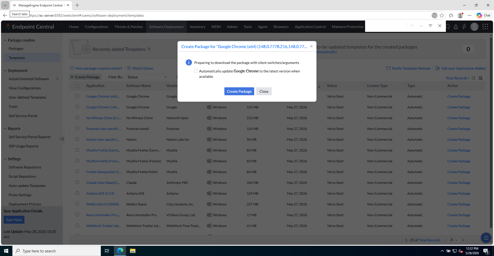
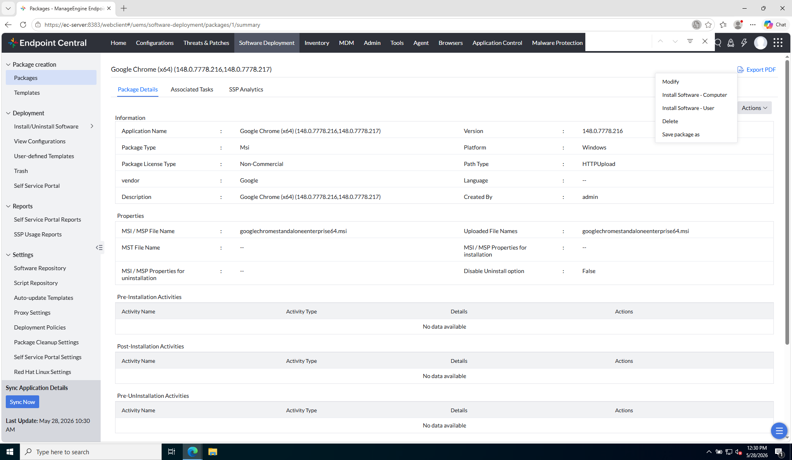

# Laboratorio M6-02 — Configurar despliegue

[← M6-01](01-templates-y-package.md) · [M6](README.md) · [Siguiente: M6-03 →](03-seguimiento-ejecucion.md)

Objetivo: lanzar **Install Software — Computer** hacia `ec-client1` con policy y target definidos.

---

### Paso 1 — Iniciar instalación

Desde el package `Chrome-Lab`:

```
Actions → Install Software — Computer
```

Se abrirá el asistente de configuración del despliegue.

**Referencia — pantalla de configuración inicial:**



---

### Paso 2 — Deployment policy

Define **cuándo** se ejecuta:

- Inmediato vs ventana programada
- Reinicio requerido o no
- Comportamiento si el usuario está logueado

**Referencia — deployment policy:**



En lab suele usarse ejecución **inmediata** o en la próxima ventana de mantenimiento que definas en la política.

---

### Paso 3 — Target (objetivo)

Selecciona el **target** de laboratorio:

- **Custom Group** → **`Grupo-Clientes`** (creado en [Segmentación del parque](../M3-segmentacion-parque/01-grupos-y-segmentacion.md))

Si aparecen **Filter** y **Exclude**:

| Opción | Qué es | En la práctica |
|--------|--------|----------------|
| **Target** | Población base del despliegue | Custom Group → `Grupo-Clientes` (solo clientes del lab). |
| **Filter** | Refina *dentro* del target | Ej.: solo PCs con cierto SO o en una OU concreta. |
| **Exclude** | Excepciones explícitas | Ej.: sacar del despliegue una OU de prueba o un servidor concreto aunque esté en el target. |

---

### Paso 4 — Deploy

Confirma y pulsa **Deploy** (o equivalente).

La consola creará una **configuración de despliegue** asociada al package.

**Comprueba:**

- No hay errores de validación en target vacío o policy incoherente.
- La configuración aparece en **View Configurations** / listado de despliegues del package.

---

## Antes de seguir

Un despliegue enterprise falla más por **target/policy** mal elegidos que por el instalador en sí.

### Pon el foco en

- **Policy** = cuándo y bajo qué condiciones se ejecuta (inmediato, ventana, reinicio…).
- **Target + filter/exclude** = a quién llega — un error aquí instala en el servidor de producción o en nadie.
- **Deploy** crea la configuración; la ejecución real la hace el agente después (como con Asset Scan).

### Preguntas de cierre

1. Repasa tu target: ¿está **solo** `ec-client1` (o su grupo)? ¿Has excluido `ec-server`?
2. Si la policy fuera «solo a las 3:00», ¿qué verías en Execution status durante la clase?
3. ¿Para qué serviría **Exclude** una OU de prueba aunque el target sea un Custom Group amplio?

→ **[M6-03 — Seguimiento de ejecución](03-seguimiento-ejecucion.md)**
