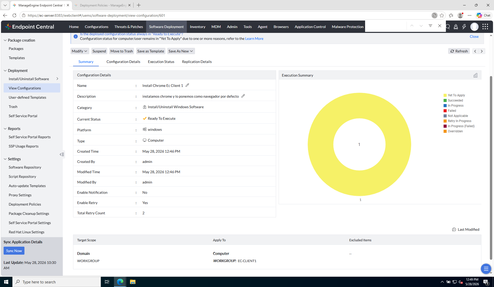

# Laboratorio M6-03 — Seguimiento de ejecución

[← M6-02](02-configurar-despliegue.md) · [M6](README.md) · [Siguiente módulo: M7 →](../M7-reporting/README.md)

Objetivo: leer el **estado de ejecución** del despliegue y validar resultado en consola (y en cliente si aplica).

---

### Paso 1 — View Configurations / Execution status

Desde el package o el módulo Software Deployment, abre:

```
View Configurations
```

(o **Execution Status** / historial de la configuración desplegada).

**Referencia — estados de ejecución:**



---

### Paso 2 — Interpretar estados

| Estado | Significado operativo |
|--------|------------------------|
| **Yet to Apply** | Tarea creada; agente aún no aplicó o espera ventana/policy |
| **In Progress** | Agente ejecutando |
| **Succeeded** / **Success** | Completado OK en ese endpoint |
| **Failed** | Error; revisar logs del agente / consola |

**Comprueba** el estado de `ec-client1`. Si está en **Yet to Apply**, espera unos minutos (intervalo del agente en tu lab) y **refresca**.

---

### Paso 3 — Validar en el cliente (si procede)

En `ec-client1`:

- ¿Aparece Chrome instalado?
- ¿Coincide con **Inventory → Software** tras un scan?

Si Failed: consulta el mensaje de error y [Checklist incidencias](../../manual-alumno/checklist-incidencias-lab.md).

---

## Antes de seguir

Desplegar software es **asíncrono**: la consola muestra estados; el agente ejecuta cuando toca.

### Pon el foco en

- **Yet to Apply** no es fallo: suele ser «en cola» o esperando ventana/agente.
- La consola es la **fuente de verdad del estado**; el cliente confirma el **resultado** (app instalada).
- Tras instalar, el inventario puede tardar — relaciona con M2 y Asset Scan.

### Preguntas de cierre

1. Anota la hora en que pasó de **Yet to Apply** a **In Progress** / **Success** (o cuánto llevaba si sigue en cola).
2. En `ec-client1`, ¿ves Chrome? Si sí, cruza con **Inventory → Software**; si no, ¿el estado en consola explica el retraso?
3. Si fuera **Failed**, ¿qué revisarías primero: policy, permisos del agente, espacio en disco, antivirus?
4. ¿Qué cambiarías en la policy para un despliegue en **horario laboral** sin molestar al usuario?

Cierra M6 cuando entiendas la cadena package → deploy → estado → endpoint.

→ **[M7 — Compliance y reporting](../M7-reporting/README.md)**
